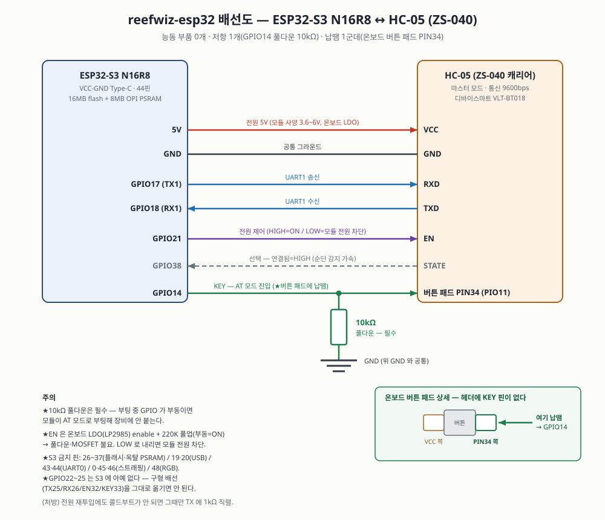
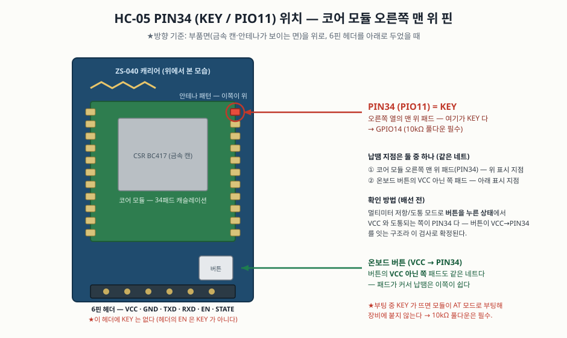
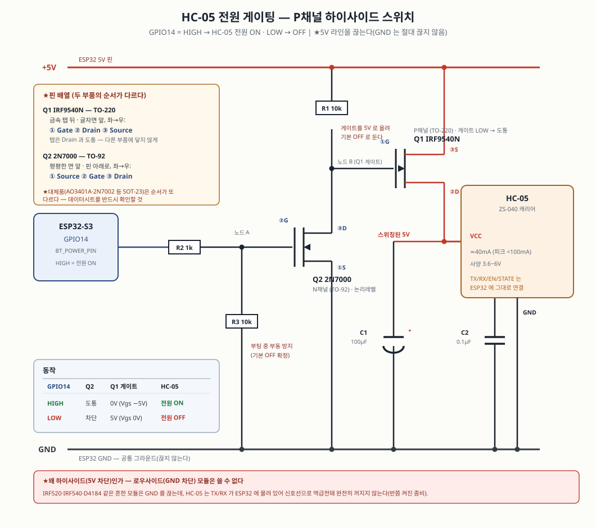

# reefwiz-esp32

reefwiz 자동 KH 측정·도저 조정 시스템의 ESP32(MicroPython) 이식.
Windows PC + 작업 스케줄러 + WSL 동기화 + GitHub Pages 를 ESP32 한 대로 대체한다.

원본: https://github.com/taeseokyi/reefwiz (bin/measure_kh_once.py V4, bin/doser_adjust.py,
bin/dkh_server.py, bin/parse_plateau_log.py, docs/index.html)

## 장비명·버전 (2026-08-30)

| | |
|---|---|
| **장비명(모델)** | **ReefWiz Controller C-1** — 코드 `RWC1`. 대시보드 브랜드(ReefWiz)를 따르고, `C-1` 은 1세대 **제어기**(ESP32-S3 + HC-05)를 뜻한다. 이 기기 자체는 KH 를 재지 않고 측정기·도징기를 물고 돌며 시키는 쪽이다 — 계열은 측정기 `M-1`, 도징기 `D-1`. 제어 구성이 바뀌면 `C-2` 가 된다 |
| **개체 시리얼** | MAC 뒤 3바이트(예: `A1B2C3`). 같은 모델을 여러 대 돌릴 때 로그·백업의 출처를 구분한다 |
| **표시 이름** | `ReefWiz Controller C-1 #A1B2C3` — 개체 구분자 `#` 는 측정기·도징기 `ver` 응답과 같은 표기 |
| **판(버전)** | `MAJOR.MINOR.PATCH+커밋` (예: `1.0.0+3f2a1c9`). 단일 진실은 `src/version.py` |

**버전 조회** — 화면 없는 장비라 다음 경로가 전부 같은 값을 보여 준다:

```bash
curl http://reefwiz.local/api/ver         # 한 줄만 → ReefWiz Controller C-1 v1.0.0 #A1B2C3
curl http://reefwiz.local/api/version     # 전체(모델·시리얼·판·빌드·런타임·가동시간, JSON)
```

`/api/ver` 는 측정기·도징기의 `ver` 명령에 대응하는 HTTP 창구다 — 응답이 **한 줄 text/plain**
이라 파싱 없이 그대로 쓰고, 장비 3종의 답이 글자 그대로 같은 모양이 된다.

- 정비페이지 맨 아래 **장비 정보** 카드(조회 버튼) — 사람이 보는 기본 경로
- 정비페이지 **상태** 카드 첫 줄 · 대시보드 **푸터** — 요약 한 줄
- 부팅 로그 첫 줄 `[boot] ReefWiz Controller C-1 v1.0.0 #A1B2C3 | 빌드 c0d7955 · … 배포`
- 설정 백업 파일(`reefwiz-backup.json`)의 `device` — 어느 기기의 어느 판에서 뜬 백업인지

**빌드 스탬프** — `tools/deploy.py` 가 배포마다 `buildinfo.py`(커밋 해시·미커밋 여부·배포
시각·배포자)를 만들어 코드와 함께 올린다(저장소에는 커밋하지 않는다).
`+dev` = 배포 도구를 거치지 않고 손으로 올린 코드(어느 커밋인지 보증 없음),
`-dirty` = 커밋하지 않은 변경이 섞인 판(표시된 커밋과 기기 내용이 다르다).

**판 올리기(3단계)** — `src/version.py` 헤더에 같은 내용이 있다:

1. `src/version.py` 의 `VERSION`·`RELEASED` 수정
   (MAJOR=데이터 형식·API 파괴 / MINOR=기능 추가 / PATCH=수정·튜닝)
2. `CHANGELOG.md` 맨 위에 그 판의 항목 추가
3. 커밋 후 `git tag v<판>` → 배포하면 기기 표시가 그 커밋을 가리킨다

## 확정 설계

- 장비 측 **HC-06 은 그대로 유지** (측정·도저 펌웨어 배선 무변경)
- ESP32 에 **HC-05 1개(마스터 모드)** 를 UART 유선 연결 → 두 HC-06 에 `AT+BIND` 를
  바꿔가며 번갈아 접속 (아래 "왜 HC-05 1개인가" 참조)
- 대시보드(docs/index.html)는 ESP32 **로컬 웹서버**로 발행 — **같은 공유기(LAN) 안에서만** 접속
- **MQTT(reefCore) 발행 제거** (사용자 지시 2026-08-13)
- 설정 저장(도징량·목표 dKH·pH 보정)은 GitHub API 커밋 대신 **로컬 POST** (토큰 불요)
- **WiFi 는 기기에서 설정** — 저장된 설정 우선, 실패 시 AP 폴백(`reefwiz-setup`)
- 보드 확정(2026-08-18): **VCC-GND Studio ESP32-S3 N16R8** — 16MB 플래시 + 8MB 옥탈 PSRAM
  (디바이스마트 VND019, 21,000원). MicroPython **SPIRAM_OCT** 변종 펌웨어를 쓴다
- **화면·SD 없음**(2026-08-18 확정) — 확인과 조치는 **웹으로만** 한다(대시보드 + `/ops.html`).
  하드웨어는 HC-05 하나뿐이고 SPI 페리페럴이 없다

## 요구사항 → 구현 대응

| 요구 | 모듈 |
|---|---|
| 측정 도구 | `measure.py` (V4 평탄 추종) + `link.py` (RF 순단 대응) |
| 측정 결과 웹 발행 | `datalog.py` (dkh.dat + 대시보드 JSON 직접 생성) |
| 도징 점검·설정 변경(수동/자동) | `doser.py` (권고·수동 오버라이드·안전 레일) |
| 각종 로그 유지 | `datalog.log` (measure_kh.log — 쓰는 도중에도 `LOG_MAX_BYTES` 에서 순환) + plateau JSONL + doser 이력 |
| 발행 페이지 서빙 | `webserver.py` → `/www/index.html`, `/www/ops.html` |
| dKH 서버 응답 API | `webserver.py` → `/api/dkh` (원본 dkh_server 와 동일 응답) |
| **측정 중단 시 조치** | `ops.py` + `/www/ops.html` (정비 페이지) |
| **WiFi 설정** | `wifinet.py` + 정비 페이지 WiFi 카드 (AP 폴백) |

## 조치(복구) 도구 — 측정이 끊겼을 때

측정은 무인 반복이라 한 번 어긋나면 사람이 개입해야 한다. 원본 운영에서 손이 가던 일들을
**웹 정비 페이지(`/ops.html`)** 에서 바로 할 수 있게 도구화했다(화면이 없으므로 유일한 경로다).

### 정비페이지 구조 — 작업 흐름대로 (2026-08-19 재구성)

```
상태            장비 상태 한 줄(색) + 배지 + 요약
스케줄          측정 회차 칩(0~23시) + 도저 자동조정 회차          ← 2026-08-21
측정 조치       지금 측정 · 측정 중단 · 에러 래치 해제
                [측정 챔버][홀딩 챔버][위치 지정] → [측정 정리]   ← 하나의 절차
                참조 교정(수조 실측 dKH 입력)
BT 연결         현재 대상 · 마지막 응답 확인 · RF 이벤트 · STATE · BIND 주소
                [<장치>로 전환 …]  ← 등록된 장치 수만큼 자동 생성
                [연결 점검][HC-05 리셋][동결 해제]
                ▸ 장치 목록        (이름·BIND 주소·시계 동기 시각, 도징기 추가/삭제)
                ▸ 명령 콘솔 → 현재 대상   (장비 선택 없음. 전환 결과를 따른다)
                ▸ 도징              (대상이 **기본 도징기**(올포리프 도저)일 때만 열린다 —
                                     수동 mL/일·목표 dKH 까지 함께 잠긴다)
백업·장기 저장소 / WiFi / 로그
```

★**명령 콘솔과 도징이 BT 연결 카드 안**에 있는 이유: "대상을 정한다 → 그 대상에게 쓴다"가
한 흐름이기 때문이다. 종전에는 콘솔에 장비 선택 드롭다운이 따로 있어서 화면의 BT 대상과
명령이 가는 곳이라는 **두 개의 진실**이 생겼다. 이제 전환은 BT 카드에서만 하고, 콘솔은
현재 대상으로만 나가며(`ops.current_target()`), 도징은 **대상이 기본 도징기일 때만** 열린다
(서버도 같은 규칙으로 거부 — `_require_primary_doser`). 빠른 명령 버튼도 대상에 맞는 세트만 보인다.

★**지금 측정 · 참조 교정 · 측정 정리는 BT 를 자동으로 측정기로 전환**한다. 그 결과가 바로
보이도록 정비페이지 폴링은 측정·작업 중에 1.5초로 빨라진다(평상시 4초).

### 장비 상태 — 한 곳에서 판정한다

정비페이지 맨 위에 **측정 장비의 현재 상태**가 한 줄로 뜬다. 판정은 `ops.device_state()`
한 곳에서만 하고, 화면과 서버 게이트가 그 결과를 함께 쓴다 — 둘이 따로 판단하면 "버튼은
눌리는데 서버가 거부"하는 혼란이 생긴다.

| 상태 | 뜻 | 명령 콘솔 |
|---|---|---|
| `measuring` 측정 중 | 회차 진행 중(수 시간) | **잠금(우회 불가)** — 임의 명령이 회차를 조용히 망친다 |
| `job` 조치 작업 | 조치 작업 실행/대기 중 | 잠금 — 끝나면 자동으로 풀린다 |
| `frozen` BT 링크 동결 | 신원 불일치 | 잠금 — 어차피 `LinkFrozen`. '동결 해제'가 먼저 |
| `latched` 에러 래치 | 마지막 회차가 에러, 정시 측정 정지됨 | 기본 잠금, **운영자 확인**으로 해제 |
| `liquid_unknown` 액체 위치 불명 | 이송 도중 중단 → 자동 정리 동결 | 기본 잠금, **운영자 확인**으로 해제 |
| `hold` 측정 보류 | **의도적으로** 정시 측정을 멈춰 둠(정비·수질 안정화) | 사용 가능 — 정비가 곧 콘솔 작업이다 |
| `idle` 대기 | 정상 | 사용 가능 |

★래치·위치 불명에서 콘솔을 완전히 막지 않는 이유: 그 둘이 **원래 콘솔로 수동 정리하는
상황**이다(사용자 결정 #10 — "에러 시 BT 연결 회복 후 명령 콘솔로 직접 정리"). 막아 버리면
"정리하려면 래치를 풀어야 하고, 래치를 풀려면 정리가 됐는지 알아야 하는" 순환이 된다.
그래서 기본은 잠그고 체크박스(운영자 확인)로만 연다. **측정 중만은 확인으로도 못 연다.**
서버는 `ack` 플래그가 있어도 `measuring` 이면 거부하고, 잠금 해제 실행은 로그에 남는다.

| 조치 | 왜 필요한가 | 경로 |
|---|---|---|
| **에러 래치 해제** | 원본은 dkh.dat 마지막 에러 줄을 *수동으로 지우기 전까지* 매 회차 측정을 건너뛴다(프로브 보호). 그 편집을 버튼 하나로 | 웹 |
| **측정 중단** | 매달린 회차를 끊는다. 비상정리(KCl 소크)까지 수행하고, 장비 이상이 아니므로 **에러 래치를 걸지 않는다** | 웹 |
| **비상정리 실행** | 정리가 실패하면 프로브가 KCl 없이 방치된다(원본 `**경고`) | 웹 |
| **액체 위치 수동 지정 → 측정 정리** | 정리 레시피를 고르는 값이라 **측정 정리와 같은 행**에 둔다(2026-08-19). 위치 불명이면 자동 정리가 동결되므로 실물을 확인해 지정한 뒤 정리를 돌린다. 챔버가 빈 것을 확인했다면 **비움/비움**으로 지정하고 정리하면 KCl 소크까지 복원된다 | 웹 |
| **연결 점검** | 부작용 없는 조회를 보내 무선 구간·펌웨어 생존을 판별한다(무해 — 먼저 이걸 쓴다) | 웹 |
| **HC-05 리셋** | **ESP32 쪽 HC-05 모듈의 전원(EN)을 0.4초 끊었다 켠다** — 장비 자체는 건드리지 않는다. 라디오가 좀비가 돼(AT 조차 무응답) 재연결로도 안 살아날 때의 최후 수단이고, Windows 에서는 불가능했던 조치다. 리셋 뒤 BIND 주소로 자동 재접속하고 **신원 서명을 다시 확인**한다(다른 장비면 그 자리에서 동결). ★위험: 재접속까지 수 초 동안 **어떤 명령도 못 보낸다** — 그 사이 펌프가 돌면 정지 명령이 안 나간다. 기기가 아는 구동은 `motor_running` 가드가 막지만 '완료 응답만 유실되고 펌프는 계속 도는' 경우는 알 수 없어, **위험을 적은 확인 대화상자**를 거쳐 실행한다. 측정 중에는 거부(회차가 깨진다) | 웹 (확인 2단계) |
| **BT 연결 상태 표시** | 지금 어느 장비에 붙어 있는지(측정 장비/도저)·신원 검증 여부·마지막 응답 확인 시각·최근 RF 이벤트·STATE 핀·BIND 주소 설정 여부·전환 가능 여부를 전용 카드에 표시. ★상태는 링크가 남긴 흔적이고 UART 를 만지지 않는다(상태 폴링은 웹 스레드라 측정 중 응답과 뒤섞인다) — 지금 살아 있는지 물으려면 '연결 점검' | 웹 |
| **장치 목록(BT 주소·이름·시계 동기)** | 기본 도징기의 표시 이름은 **올포리프 도저**(실물 명칭 — `devices.PRIMARY_DOSER_NAME`, id 는 `doser` 그대로). 상대 HC-06 의 BIND 주소를 웹에서 넣는다(2026-08-19). MAC 을 그대로 붙여 넣어도 된다 — `98:DA:60:0F:C5:7A` / `98DA600FC57A` / `98da,60,0fc57a` 가 모두 같은 값으로 정규화된다. **2026-08-21: 도징기를 여러 대(최대 `DOSER_MAX`=4) 등록**하고 장치마다 시계 동기 시각을 준다. `/data/devices.json` 에 저장되고 **`config.py` 값보다 우선**한다(구형 `bt.json` 도 읽어 마이그레이션). 백업 번들에도 포함 | 웹 |
| **측정 회차 설정** | 측정 시각(시 단위)과 도저 자동조정 회차를 웹에서 바꾼다(2026-08-21). **최소 간격 2시간**(자정을 넘는 간격도 원형으로 검사), 최대 12회/일, 조정 회차는 측정 회차 안이어야 한다. `/data/schedule.json` 우선, config 폴백. 하루 1회처럼 도저 계산 최소 점수(`MIN_VALID`)를 못 채우는 설정은 **저장은 되고 경고**를 준다 | 웹 |
| **BT 대상 전환** | HC-05 1개를 측정기/도징기들에 다시 바인드하고 **신원을 검증**. 불일치면 동결(오장비 명령 방지), 해제는 운영자 확인 후에만. **측정 중·모터 구동 중에는 잠긴다**. ★검증이 보장하는 것은 "요청한 **종류**가 응답했다"까지다 — 도징기끼리는 응답 서명이 같아 구분할 수 없으므로 도징량 조작을 기본 도징기 1대로 제한한다 | 웹 |
| **측정 보류(정비 래치)** | 정비·수질 안정화 동안 **정시 측정을 의도적으로 멈춘다**(2026-08-30). 에러 래치를 일부러 만들어 멈추던 것을 대체한다 — 그건 고장과 구분되지 않고(빨강 깜빡) `dkh.dat` 에 회차마다 `0.000` 줄이 쌓였다. ★보류는 **아무것도 기록하지 않는다**(건너뛴 회차는 흔적 없음), LED 는 파랑, **수동 '지금 측정'은 그대로 된다**(정비 뒤 확인 측정이 그 용도). ★걸어 두고 잊는 것을 막으려고 **해제 예정 시각을 함께 정한다**(4h/12h/24h/3일/무기한) — 만료되면 메인 루프가 자동 해제하고 로그를 남긴다. 재부팅을 견딘다(`/data/measure_hold.json`). 건너뛴 회차는 **슬롯을 소비한다** — 안 그러면 해제하는 순간 지나간 회차가 곧바로 시작된다 | 웹 |
| **장비 상태 표시** | 측정 중 / 조치 작업 / BT 동결 / 에러 래치 / 액체 위치 불명 / **측정 보류** / 대기(Idle)를 페이지 맨 위에 색과 함께 한 줄로. 위 표 참조 | 웹 |
| **명령 콘솔** | 에러 후 수동 정리의 핵심 — 링크 회복(ensure_link 자동) 후 직접 명령으로 정리. 모터 명령(mXf/b:N)은 '[모터N] 완료'까지 대기, 일반 명령은 지정 시간 응답 수집. 복구 순서 빠른 버튼(status/airoff/ton/배출/KCl) + 응답 이력 표시. 전량 로깅 | 웹 |
| **즉시 측정 / 참조 교정** | 실패 회차 재시도, calref(ref dKH 역산 — 수조 실측 dKH 입력란·버튼, 원본 `--setref` 상당) | 웹 |
| **도저 권고 미리보기** | 장비를 만지지 않고 지금 데이터로 나올 권고만 계산(원본 `doser_adjust --dry-run`) | 웹 |
| **도징기 시계 동기** | 도징기는 자체 타이머로 도징한다 — 시계가 밀리면 도징 시각이 어긋난다. **장치별 지정 시각**(장치 목록의 `sync_hours`, 기본 0시)에 자동 실행하며 측정 중이면 미뤘다가 끝난 뒤 돈다(원본 스케줄러 `set_time.py doser` 상당). ★이 명령만은 대상을 가리지 않고 **자동 전환**한다: `set time` 은 값이 전 도징기 동일해 주소가 뒤바뀌어도 무해하고, 여러 대를 수동 전환으로 돌리게 하면 쓸 수 없는 도구가 된다. ★**수동 버튼은 두지 않는다**(사용자 지시 2026-08-21) — 측정기가 동작 중에 실행돼선 안 되는 작업이라 누를 수 있는 버튼 자체를 없앴다. 작업(`doser_clock`)은 API 에 남아 있다(`POST /api/ops/job`, 측정 중에는 거부) | 자동 |
| **로그 확인** | 진행 상황·`**경고` 확인 | 웹 |

**UART 안전**: 장비를 만지는 작업은 전부 `state.put_job()` 으로 큐잉되고 **메인 루프에서만**
실행된다. 웹 스레드가 측정 중 UART 에 끼어들면 응답이 뒤섞여 오측정이 되기 때문이다.
결과는 `/api/ops/result` 폴링으로 표시된다.

## 상태 표시등 — 온보드 RGB LED (GPIO48)

화면이 없는 장비라(2026-08-18 결정) **온보드 WS2812 RGB LED** 하나로 상태를 한눈에 알린다.
측정 결과는 대시보드나 시리얼로 따로 보고, 이 LED 는 **"지금 문제가 있나"만** 알리는 경고등이다.
**평상시(모든 정상)에는 꺼져 있는 것이 원칙**이다. 핀은 실측 확인(**GPIO48**, `(r,g,b)` 매핑 정상).

| 색 · 패턴 | 뜻 | 조건 |
|---|---|---|
| **소등** | 정상 | 시각 동기됨 · 에러/동결 없음 · WiFi 연결 · BT 대상 검증됨 |
| **파랑 상시** | **의도된 측정 보류** | 정비·수질 안정화로 정시 측정을 멈춰 둠 — 고장이 아니지만 측정은 안 돈다 |
| **앰버(주황) 상시** | 경고(측정은 계속됨) | WiFi 끊김/AP 폴백 모드 — **대시보드 접근만 불가, 측정과는 무관** |
| **빨강 깜빡** | 치명(측정이 안 됨/위협받음) | **BT 대상 미검증**(측정 장비에 못 붙음 = 측정 불가·원격 꺼짐/전환 실패) · **에러 래치**(프로브 보호로 측정 정지) · **BT 링크 동결**(신원 불일치) · **시각 미동기**(정시 측정 게이트 닫힘) |
| **초록 0.25초** | 부팅 확인 | 전원/리셋 직후 1회 — LED 가 살아 있음을 알림 |

- 우선순위: **치명(빨강) > 보류(파랑) > 경고(앰버) > 정상(소등)**. ★보류가 앰버보다 위인 이유:
  앰버의 뜻이 "측정은 계속됨"이라, 정시 측정을 멈춰 둔 상태에서 앰버를 켜면 거짓말이 된다. 메인(측정) 루프가 매 틱 상태를 계산해
  구동한다(`main._update_led` → `statusled.render`). 밝기는 `config.LED_BRIGHT`(눈부심 방지).
- **경고 vs 치명의 기준**: 이 장비의 주 목적은 측정이다. **측정이 계속되는 저하는 앰버**(WiFi
  끊김 — 대시보드만 못 보고 측정은 됨), **측정이 안 되는 상태는 빨강 깜빡**(BT 대상 미검증=측정
  장비에 못 붙음 · 에러 래치 · 링크 동결 · 시각 미동기). ★BT 미검증은 측정 자체가 불가하므로 치명이다.
- ★알려진 한계: 부팅 직후 **부팅 BT 자동연결(~40초)** 이 루프보다 먼저 블로킹돼 그 구간에는
  LED 가 잠시 소등된다(경고를 아직 못 켠다). 개선 여지 — 부팅 중 별도 표시색.
- 끄고 싶으면 `config.LED_PIN` 을 다른 값/미배선으로 두면 `statusled` 가 조용히 비활성된다.

## 왜 HC-05 1개인가 (ESP32 내장 블루투스로 안 되는 이유)

**★2026-08-18 확정: HC-05 를 1개만 쓰고 두 장비에 번갈아 접속한다.** 측정기와 도저는
동시에 붙들 필요가 없다(main 루프가 순차 실행). 전환에 8~12초 걸리지만 속도는 요구사항이
아니다. 종전의 "장비당 전용 모듈 1개" 안을 대체한다.

**1. ESP32 하드웨어는 Bluetooth Classic(SPP)을 지원한다 — 그런데 MicroPython 이 안 열어준다.**
ESP32-WROOM-32 칩에는 BR/EDR(Classic) + BLE 가 다 있고, Arduino/ESP-IDF 의 `BluetoothSerial` 을
쓰면 SPP 마스터로 HC-06 에 접속할 수 있다. 하지만 **MicroPython ESP32 포트는 BLE 만 노출**하고
Classic/SPP API 가 없다(비공식 커스텀 펌웨어만 존재). 파이썬으로 가려면 외부 라디오가 필요하다.
※S3/C3/C6 계열은 하드웨어 자체가 Classic 미지원이라 **보드를 바꾸면 이 길은 영영 닫힌다** —
내장 BT 를 쓰기로 하면 구형 ESP32 에 영구히 묶이므로 "더 고성능 보드로 교체" 계획과 충돌한다.

**2. 그래서 외부 HC-05 를 쓰되, 개수는 1개다.** HC-05 는 SPP 점대점이라 한 번에 한 슬레이브만
붙든다. `AT+BIND` 를 바꿔가며 번갈아 쓰는 방식은 **바인드가 어긋나면 도저 명령이 측정기로 가는
사고**가 가능하다는 것이 유일한 위험이었는데, 이를 코드로 막았다(아래).

### 오장비 명령을 막는 5중 레일

원본의 "거짓 성공은 있으면 안 된다"(이송 전 airoff·ton 검증) 원칙을 링크 계층에 적용한 것이다.

1. **신원 검증** — 전환 후 첫 구동 명령 전에 부작용 없는 조회를 보내 응답 서명을 확인한다
   (측정기 `status` → `============` / 도저 `ls` → `왼쪽 동작·왼쪽 휴지`). 서명이 확인되기
   전에는 어떤 명령도 나가지 않는다. 다른 장비의 서명이 오면 **즉시 동결**하고, 동결 상태에서는
   `send()` 가 `LinkFrozen` 을 던진다. 자동 해제는 없다 — 배선·BIND 주소 확인 없이 풀면 같은
   오접속을 반복하므로 정비페이지의 명시적 '동결 해제'로만 푼다.
2. **교차 프로브** — 대상의 조회에 침묵이 오면 다른 장비의 조회 형식으로 한 번 더 묻는다.
   장비마다 줄 종단이 달라(측정기 CRLF / 도저 LF only) 엉뚱한 장비에 붙으면 아예 응답이 없는
   경우가 많은데, 그러면 '상대 전원 꺼짐'과 'BIND 주소 뒤바뀜'이 구분되지 않는다. 둘 다
   안전하기는 같지만 운영자가 할 일이 완전히 다르다.
3. **모터 구동 중 전환 금지** — 전환은 곧 라디오 전원 차단이다. 모터가 도는 중에 끊으면 정지
   명령을 보낼 수단이 사라져 **시약이 계속 주입된다**. `Link.motor_running` 이 세팅된 동안은
   전환·리셋이 모두 거부된다.
4. **★측정 중 전환 금지** — 측정 회차 도중에 대상을 바꾸면 이어지는 측정 명령(`tank`/`ref`/
   `calkh`)이 도저로 가고, 폭기·이송이 끊긴 채 회차가 계속된다. 그래서 `state.measuring` 인
   동안 `select_target()` 은 거부하며, **`force=True` 로도 뚫리지 않는다** — 바꾸려면 정비페이지
   '측정 중단'이 먼저다(중단은 비상정리까지 하고 래치를 걸지 않는다). 측정 흐름 자신이 자기
   장비를 잡는 경로(`measure.make_link()` → `allow_measuring=True`)만 지나간다. 이미 붙어 있는
   대상을 다시 요청하는 것은 라디오를 건드리지 않으므로 측정 중에도 통과한다.
   웹 계층도 같은 규칙이다: 측정 중에는 조치 작업이 큐잉되지 않고, 정비페이지의 전환·리셋
   버튼은 **비활성**으로 그려진다(누를 수 있는 버튼을 두면 실패 메시지로 배우게 된다).
5. **★도징량 경로를 1대로 제한(2026-08-21)** — ①②가 보장하는 것은 "요청한 **종류**의 장비가
   응답했다"까지다. 도징기가 여러 대면 응답 서명이 서로 같아(`ls` → `왼쪽 동작`) **어느
   도징기인지는 원리적으로 구분할 수 없다.** 그래서 도징량(`lrt`)을 보내는 경로를 **기본
   도징기(장치 목록 맨 위 — 실물은 **올포리프 도저**) 1대**로 묶었다
   (`ops._require_primary_doser` — 추가 도징기에 붙어 있으면 조회·적용 모두 거부).
   `set time` 은 값이 전 도징기 동일해 주소가 뒤바뀌어도 무해하므로 예외로 자동 전환을 허용한다.
   ★정비페이지의 도징 섹션은 **수동 mL/일·목표 dKH 까지 함께 잠근다**(사용자 지시 2026-08-21).
   이 둘은 파일에 저장되는 값이라 기술적으로는 대상과 무관하지만, 다른 도징기에 붙어 있는
   화면에서 도징량을 바꾸면 그 장비를 설정하는 것으로 오해하게 된다. **잠금은 정비페이지의
   규칙이고 서버는 막지 않는다** — 같은 두 API(`/api/override`·`/api/config`)를 **대시보드**가
   쓰기 때문이다(대시보드는 알칼리 도징 전용 화면이고 BT 대상 개념이 없다).
   ※그래서 `_other_sigs()` 는 **종류 기준**이다 — 같은 종류의 서명을 '남의 것'으로 넣으면
   도징기 2대 구성에서 정상 응답이 곧 오접속 판정이 되어 전환이 매번 동결된다.

`tools/test_measure_sim.py` 의 시나리오 E·F·G 가 이 다섯을 전부 검증한다(오접속 동결, 동결 중
송신 차단, 모터 중 전환 거부, BIND 주소 미설정 시 거부, 측정 중 전환 거부·force 무력화,
도징기 2대에서 전환이 동결되지 않는지 + 추가 도징기의 도징량 조작 거부).

**★BIND 주소는 실장 전 반드시 채울 것** — 정비페이지 'BT 연결 → 장치 목록'에서 넣는다
(`config.BIND_ADDR_*` 는 폴백). 비어 있으면 전환이 즉시 실패한다(빈 주소로 아무 데나 붙는
것을 막기 위해 의도적으로 그렇게 했다). 주소는 `AT+INQ` 로 검색하며 저장 형식은 콜론이
아니라 콤마다: `98d3,31,fb1234` — 입력은 MAC 을 그대로 붙여 넣어도 변환된다.

전환 방법은 두 가지이고(KEY 만 쓰는 고속 경로 / 전원 재투입 경로) 아래
"전환 시퀀스" 절에서 다룬다.

## 배선

화면·SD 를 뺐으므로(2026-08-18) 연결되는 부품은 **HC-05 하나**다. 신호선 4개뿐이다.
도면: [`docs/wiring-hc05.svg`](docs/wiring-hc05.svg) (아래 "HC-05 배선" 절에 그림·ASCII 함께).

| ESP32-S3 핀 | 연결 | 용도 |
|---|---|---|
| GPIO17 (TX1) / GPIO18 (RX1) | HC-05 RXD/TXD | 장비 링크(측정기·도저 공용) |
| GPIO21 | **HC-05 KEY** = 헤더의 `EN` 핀 | ★2026-08-29 실측: 이 보드의 EN 은 전원이 아니라 **KEY** 다. HIGH=AT 모드 / LOW=데이터 모드. **납땜 불요** |
| GPIO14 | *(비어 있음)* — 전원 게이팅용 예약 | MOSFET 을 달면 여기로 HC-05 VCC 를 끊는다(아래 절) |
| GPIO38 | HC-05 STATE | 연결됨=HIGH(실측 검증). 순단 감지 가속 |
| 5V, GND | HC-05 VCC/GND | 모듈 사양 3.6~6V(온보드 LDO), 로직 3.3V |

**★ESP32-S3 는 못 쓰는 핀이 따로 있다** — 구형 ESP32 배선을 그대로 옮기면 안 된다:

| 핀 | 왜 못 쓰나 |
|---|---|
| GPIO26~32 | 내장 SPI 플래시(16MB) |
| **GPIO33~37** | **옥탈(OPI) PSRAM(8MB)** — N16R8 의 R8 이 옥탈이라 헤더에 33·34 가 나와 있어도 못 쓴다 |
| GPIO19·20 | 네이티브 USB D-/D+ |
| GPIO43·44 | UART0 (CH343 USB-시리얼 브리지) |
| GPIO0 / 45 / 46 | BOOT 버튼·스트래핑 핀 |
| GPIO48 | 온보드 RGB LED(WS2812) |
| GPIO22~25 | **S3 에는 존재하지 않는다** — 종전 배선의 TX=25 / RX=26 / EN=32 / KEY=33 이 전부 이 표에 걸린다 |

남는 여유 핀: 1~13, 15, 16, 38~42, 47. 핀 배정은 전부 `src/config.py`.

**★2026-08-29 실측으로 배선이 바뀌었다**: 이 보드의 헤더 **`EN` 은 전원이 아니라 KEY** 였다.
**GPIO21 → EN(=KEY)** 하나로 AT/데이터 모드가 완전히 제어되며 **PIN34 납땜은 필요 없다**.
GPIO14 는 전원 게이팅(MOSFET)용으로 비워 둔다 — 아래 "HC-05 배선" 절 참조.

## HC-05 배선 (GPIO21=KEY) — 헤더 6핀만, 납땜 0군데



### PIN34(KEY) 위치 — *(참고: 이 보드에서는 납땜이 필요 없다)*

★2026-08-29 실측으로 **헤더 `EN` 이 곧 KEY** 임이 확인되어, 아래 납땜 방법은 **더 이상 쓰지
않는다**. 다른 ZS-040 리비전(EN 이 전원 차단으로 동작하는 보드)을 만났을 때만 참고한다.

<details>
<summary>PIN34 직접 납땜 방법 (펼치기)</summary>



**방향 기준**: 부품면(금속 캔·안테나 패턴이 보이는 면)을 위로 두고 **6핀 헤더를 아래**로
향하게 놓는다. 그 상태에서 **코어 모듈 오른쪽 열의 맨 위 패드가 PIN34(PIO11)** = KEY 다.

납땜은 둘 중 어디에 해도 같다(같은 네트): ①코어 모듈 오른쪽 맨 위 패드(PIN34) ②온보드
버튼의 VCC 아닌 쪽 패드(패드가 커서 쉽다 — 버튼이 `VCC → PIN34` 를 잇는 구조).

**확인법**: 멀티미터 도통 모드로 **버튼을 누른 상태**에서 VCC 와 도통되는 쪽이 PIN34 다.
이 검사 하나로 확정되며 캐리어 리비전이 달라도 통한다.

</details>

```
  ESP32-S3 N16R8                                 HC-05 (ZS-040)
 +---------------+                            +-----------------------+
 |           5V  |--------------------------->| VCC   (3.6~6V)        |
 |          GND  |--------------------------->| GND   (공통 그라운드)  |
 |  GPIO17 (TX1) |--------------------------->| RXD                   |
 |  GPIO18 (RX1) |<---------------------------| TXD                   |
 |       GPIO21  |--------------------------->| EN  (=KEY)            |
 |       GPIO38  |<---------------------------| STATE                 |
 +---------------+                            +-----------------------+
    GPIO14 는 전원 게이팅(MOSFET)용으로 예약 — 위 '★HC-05 전원 게이팅' 절
```

- **★헤더 `EN` 이 곧 KEY 다**(2026-08-29 실측 확정) — `EN=HIGH` → AT 모드(`AT` 에 `OK` 응답),
  `EN=LOW` → 데이터 모드(장비 응답 정상). 따라서 **코어 PIN34 에 납땜할 필요가 없다**.
  ★KEY 선을 두 개(EN + PIN34 납땜선) 물리면 서로 싸워 AT 진입이 깨진다 — **하나만** 연결한다.
- **풀다운은 달지 않아도 된다** — 부팅 중 EN 이 부동이면 보드 풀업으로 AT 모드가 될 수 있으나,
  `link.Link.__init__` 이 링크 생성 시 KEY 를 즉시 LOW 로 내려 데이터 모드로 되돌린다.
  (부팅 직후 잠깐 AT 모드에 머무는 것은 통신에 영향이 없다.)
- **EN 으로는 전원을 끊을 수 없다** — 이 보드에는 'EN→LDO ON/OFF' 회로가 없다. 전원 재투입이
  필요하면 별도 하드웨어가 있어야 한다(위 '★HC-05 전원 게이팅' 절).

기준 보드: **ZS-040 캐리어**(예: 디바이스마트 VLT-BT018, 4,700원). 실측으로 확정된 사실:

- **`EN` 헤더 핀 = KEY(코어 PIN34/PIO11).** HIGH=AT 모드 / LOW=데이터 모드.
  ※일부 ZS-040 리비전에는 EN 이 LDO(LP2985) ON/OFF 에 물려 전원 차단으로 동작하는 것도 있다
  (`EN—1K—노드—220K—VCC`). **실물로 확인할 것** — EN 을 LOW 로 내려도 모듈이 안 꺼지면
  이 보드처럼 KEY 형이다.
- **`STATE` = 코어 PIN32.** 미연결 LOW / 연결 HIGH (실측 검증).
- **전원 차단 수단 없음** → 대상 전환의 마지막 단계인 콜드 부팅을 자동화하려면 MOSFET 필요.

| ESP32-S3 | HC-05 | 비고 |
|---|---|---|
| GPIO17 (TX1) | RXD | |
| GPIO18 (RX1) | TXD | |
| **GPIO21** | **EN (=KEY)** | HIGH=AT 모드 / LOW=데이터 모드. `config.BT_KEY_PIN` |
| GPIO38 | STATE | 연결=HIGH. `config.BT_STATE_PIN` |
| *(GPIO14)* | — | 전원 게이팅 MOSFET 게이트용 예약(`config.BT_POWER_PIN`) |
| 5V, GND | VCC, GND | 보드 사양 3.6~6V(온보드 LDO). ★MOSFET 을 달면 5V 는 그쪽 경유 |

**부팅 중 AT 모드 진입 걱정은 없다**: ESP32 부팅 중 GPIO 가 잠깐 부동이면 보드 풀업으로 KEY 가
뜰 수 있지만, `link.Link.__init__` 이 링크를 만들 때 KEY 를 즉시 LOW 로 내려 데이터 모드로
되돌린다(2026-08-28 추가한 부팅 보호). 별도 풀다운 저항은 필요 없다.

STATE 를 배선하면 순단 감지가 빨라진다 — 3초 핑 타임아웃을 기다리지 않고 즉시 '끊김'으로
판정한다. 다만 **신원 검증을 대체하지는 않는다**: STATE 는 '붙었다'만 알려줄 뿐 '누구와'
붙었는지는 모른다.

## ★HC-05 전원 게이팅 (무인 자동 전환의 전제) — MOSFET 회로

**왜 필요한가** (2026-08-29 실측): 이 HC-05(펌웨어 3.0-20170601)는 `AT+LINK` 가 항상 FAIL 이라
'지금 즉시 붙이기'가 안 된다. 대상 전환의 마지막 단계는 **전원을 껐다 켜는 것**뿐이다 —
재바인드(`AT+RMAAD`→`AT+BIND`)만 하고 60초를 기다려도 새 대상에 붙지 않았고, **전원을 껐다 켜니
약 5초 만에** 붙었다. 그리고 헤더의 `EN` 은 이 보드에서 전원이 아니라 KEY 여서(위 배선표) 전원을
끊을 수단이 없다. 그래서 **VCC 를 반도체 스위치로 끊어야** 정시 측정마다 일어나는 측정기↔도저
전환이 사람 손 없이 완결된다(현재는 수동 토글 스위치로 대신하고 있다).

**★기성 모듈은 쓸 수 없다** (2026-08-29 조사): 시중의 MOSFET 스위치 모듈은 거의 전부
**N채널 로우사이드**(IRF520·IRF540·D4184 …)여서 **GND 를 끊는다**. HC-05 는 TX/RX 가 ESP32 에
물려 있어 GND 를 끊어도 신호선으로 역급전돼 완전히 꺼지지 않는다 — 반쯤 켜진 좀비가 된다.
`L298N` 도 안 된다(다링턴 2단이라 **1.4~3.2V 강하** → 5V 공급이 HC-05 하한 3.6V 아래로 내려간다).
알리의 P채널 하이사이드 모듈은 대부분 **12~36V 부하용**이라 5V 동작이 보장되지 않는다.
⇒ **아래 부품으로 직접 조립하거나, 릴레이 모듈(1채널 5V, ≈1,000원)로 접점 차단**한다.

**부품 명세** (전부 관통형이라 브레드보드에 그대로 꽂힌다. 링크는 디바이스마트):

| 기호 | 부품 | 패키지 | 규격 | 수량 | 디바이스마트 |
|---|---|---|---|---|---|
| Q1 | **IRF9540N** (P채널 MOSFET) | TO-220 | Vds −100V, Id −23A, Rds(on) 0.117Ω @Vgs −4.5V | 1 | [상품 11781](https://www.devicemart.co.kr/goods/view?no=11781) |
| Q2 | **2N7000** (N채널 MOSFET) | TO-92 | Vds 60V, Id 200mA, 논리레벨 | 1 | [상품 12089](https://www.devicemart.co.kr/goods/view?no=12089) |
| R1, R3 | 저항 **10 kΩ** | 1/4W 막대 | 103J(5%) 또는 103F(1%) | 2 | [103J 5% 856](https://www.devicemart.co.kr/goods/view?no=856) · [103F 1% 2034](https://www.devicemart.co.kr/goods/view?no=2034) |
| R2 | 저항 **1 kΩ** | 1/4W 막대 | 102J(5%) | 1 | [상품 876](https://www.devicemart.co.kr/goods/view?no=876) |
| C1 | 전해 커패시터 **100 µF** | DIP(래디얼) | 50V, 유극성 | 1 | [상품 1320](https://www.devicemart.co.kr/goods/view?no=1320) |
| C2 | 세라믹 커패시터 **0.1 µF** | DIP | 50V, 무극성(104) | 1 | [상품 1343](https://www.devicemart.co.kr/goods/view?no=1343) |

대체 가능 부품: Q1 → `IRF4905`·`IRF9540` / Q2 → `2N7002`(SMD)·`2N3904`(NPN, TO-92).
★대체 시 **핀 순서가 다를 수 있으니** 아래 핀 배열 절을 반드시 다시 확인한다.
저항은 5%(J급)면 충분하다 — 이 회로의 저항값은 정밀도가 필요 없다(풀업/풀다운/보호용).

**★IRF9540N 이 논리레벨이 아닌데 왜 되나**: 이 회로는 GPIO 가 Q1 게이트를 직접 몰지 않는다.
Q2(논리레벨 N-FET)가 게이트를 **GND 까지 끌어내려** Vgs = 0V − 5V = **−5V** 를 만든다 —
데이터시트의 Rds(on) 측정 조건(−4.5V)보다 깊어 완전히 켜진다. 부하도 HC-05 40mA 뿐이라
강하는 0.117Ω × 0.04A ≈ **5mV**, 발열은 0.2mW 로 무시할 수준이다(방열판 불요).
(★GPIO 로 P-FET 게이트를 직접 몰면 안 된다 — 3.3V 로는 5V 소스의 P-FET 이 안 꺼진다.
  Q2 반전 단이 필요한 이유가 이것이다.)

**핀 배열** (데이터시트 확인 — ★두 부품의 순서가 서로 다르니 반드시 확인하고 꽂을 것):

```
  Q1  IRF9540N (TO-220)                Q2  2N7000 (TO-92)
  금속 방열판이 뒤, 글자면이 앞          평평한 면이 앞, 핀은 아래로

      ┌───────────┐  ← 금속 탭             ___
      │           │                      /     \
      │  IRF9540N │                     | 2N7000|   ← 평평한 면(글자)
      │           │                     |_______|
      └─┬──┬──┬───┘                       │  │  │
        │  │  └── ③ Source  → +5V         │  │  └── ③ Drain  → Q1 Gate
        │  └───── ② Drain   → HC-05 VCC   │  └───── ② Gate   → R2 → GPIO14
        └──────── ① Gate    → R1/Q2       └──────── ① Source → GND
         (왼쪽부터 G · D · S)                (왼쪽부터 S · G · D)
```

- **IRF9540N (TO-220)**: ①Gate ②Drain ③Source — 금속 탭은 내부적으로 Drain 과 같다(다른 부품에
  닿지 않게 둔다). 방열판은 필요 없다(발열 0.2mW).
- **2N7000 (TO-92)**: ①Source ②Gate ③Drain.
- 대체품을 쓸 경우 **패키지가 같아도 핀 순서가 다를 수 있다** — 데이터시트를 반드시 확인한다
  (예: SMD `AO3401A`·`2N7002` 는 SOT-23 에서 ①Gate ②Source ③Drain 로 또 다르다).

**배선표** (이대로 꽂으면 된다 — 총 11 연결):

| # | 부품·핀 | 연결 대상 |
|---|---|---|
| 1 | **Q1 ③ Source** | **+5V** (ESP32 5V 핀) |
| 2 | **Q1 ② Drain** | **HC-05 VCC** — ★여기가 스위칭되는 전원이다 |
| 3 | **Q1 ① Gate** | R1 한쪽 · Q2 ③ Drain (두 곳이 같은 노드) |
| 4 | R1 (10kΩ) 반대쪽 | **+5V** — 게이트를 5V 로 당겨 기본 OFF |
| 5 | **Q2 ③ Drain** | Q1 ① Gate (위 3번과 같은 노드) |
| 6 | **Q2 ① Source** | **GND** |
| 7 | **Q2 ② Gate** | R2 한쪽 · R3 한쪽 (같은 노드) |
| 8 | R2 (1kΩ) 반대쪽 | **ESP32 GPIO14** |
| 9 | R3 (10kΩ) 반대쪽 | **GND** — 부팅 중 부동 방지(기본 OFF 확정) |
| 10 | C1 (100µF 전해) | **+** → HC-05 VCC(=Q1 Drain) · **−** → GND ★극성 주의 |
| 11 | C2 (0.1µF 세라믹) | 한쪽 → HC-05 VCC · 다른 쪽 → GND (무극성, 방향 무관) |

★**C1 과 C2 는 같은 두 지점(HC-05 VCC ↔ GND)에 나란히(병렬) 붙는다** — HC-05 의 다른 핀으로
가지 않는다. 역할이 달라서 둘 다 단다: C1(전해)은 전원 재투입 순간의 큰 전류 변동을 받아 주고,
C2(세라믹)는 전해가 잡지 못하는 고주파 노이즈를 없앤다. **모듈 VCC·GND 핀에 최대한 가깝게** 둔다
(브레드보드라면 바로 옆 홀).

**ESP32-S3 쪽 최종 핀 배열** (HC-05 관련 전부):

| ESP32-S3 | 상대 | 비고 |
|---|---|---|
| GPIO17 (TX1) | HC-05 **RXD** | |
| GPIO18 (RX1) | HC-05 **TXD** | |
| **GPIO21** | HC-05 **EN**(=KEY) | HIGH=AT 모드 / LOW=데이터 모드 |
| GPIO38 | HC-05 **STATE** | 연결=HIGH |
| **GPIO14** | **R2 → Q2 게이트** | HIGH=HC-05 전원 ON |
| 5V | **Q1 Source** (HC-05 에 직결하지 않는다) | Q1 Drain 이 HC-05 VCC 로 간다 |
| GND | HC-05 GND · Q2 Source · R3 · C1/C2 | **공통 GND — 절대 끊지 않는다** |

**회로도** — 하이사이드 스위치(**5V 라인**을 끊는다. GND 는 절대 끊지 않는다 — 신호선 역급전):



<details>
<summary>같은 회로 (텍스트 버전 — 브레드보드에서 보며 꽂을 때)</summary>

```
   +5V ──┬──────────────────┬
         │                  │ ③S
        R1 10k         ┌────┴─────┐
         │             │ Q1       │  IRF9540N (P채널)
         ├─────────────┤① G       │  게이트가 LOW → 도통(ON)
         │             └────┬─────┘
         │                  │ ②D
         │                  ├──────────────→ HC-05 VCC
         │                  │
         │                 C1 100µF ─┬─ C2 0.1µF
         │                  │        │
         │                 GND      GND
         │
         │            ③D ┌──────────┐
         └───────────────┤ Q2       │  2N7000 (N채널)
                         │② G  ①S   │
                         └──┬────┬──┘
                            │    └──── GND
              GPIO14 ──R2───┤
                     1k     │
                           R3 10k
                            │
                           GND
```

</details>

**동작**:

| GPIO14 | Q2 | Q1 게이트 | Q1 | HC-05 |
|---|---|---|---|---|
| **HIGH (3.3V)** | 도통 | GND 로 끌림(0V) | Vgs=−5V → **ON** | **전원 공급** |
| **LOW (0V)** | 차단 | R1 이 5V 로 올림 | Vgs=0V → **OFF** | **전원 차단** |

★부팅 중 GPIO 가 부동이어도 **R3 가 Q2 게이트를 내려 기본 OFF** 다. 부팅 직후 코드가 HIGH 로
올려 켜므로, 전원 인가와 동시에 HC-05 가 한 번 콜드 부팅되는 셈이라 오히려 유리하다
(전환의 마지막 단계가 콜드 부팅이므로).

**조립 후 확인 절차** (HC-05 를 연결하기 전에 먼저 해 볼 것):

1. Q1 Drain(=HC-05 VCC 자리)과 GND 사이에 **멀티미터를 전압 모드**로 물린다.
2. GPIO14 를 LOW 로 둔 상태(또는 미연결) → **0V** 가 나와야 한다.
3. GPIO14 를 HIGH 로 올린다 → **4.9~5.0V** 가 나와야 한다(강하 5mV 수준).
   ```python
   from machine import Pin
   p = Pin(14, Pin.OUT)
   p.value(1)   # → 5V 나와야 함
   p.value(0)   # → 0V 나와야 함
   ```
4. 두 값이 나오면 배선이 맞다. 그때 HC-05 VCC 를 Q1 Drain 에 연결한다.
   ★3V 대가 나오면 Q1 이 완전히 안 켜진 것 — Q2 배선(특히 ①Source→GND)을 다시 본다.

**적용 설정**:

```python
# config.py
BT_POWER_PIN = 14               # Q2 게이트(R2 경유)
BT_POWER_ACTIVE_HIGH = True     # HIGH=ON
BT_POWER_OFF_SECS = 0.5         # 방전 대기(0.4~1.0초면 충분)
```

이 세 줄이면 `link._power_cycle()` 이 살아나 **대상 전환·좀비 복구가 완전 자동**이 된다 —
지금처럼 사람이 토글 스위치를 누를 필요가 없어진다.

## 전환 시퀀스 — 고속 경로(기본)와 전원 경로(폴백)

`config.BT_SWITCH_MODE` 로 고른다(`auto` 기본 = 고속 시도 후 실패 시 전원 폴백).

**고속 경로 (`key`) — 회당 1~2초, 전원을 끊지 않는다**

데이터시트(ZG1643)의 AT 모드 진입 **Way 1**: 전원이 켜진 상태에서 PIN34 를 HIGH 로 올리면
AT 모드로 들어간다. 주 (3) *"When PIN34 keeps high level, all commands can be used"* — 전환
내내 KEY 를 올려둔 채 진행하므로 전 명령을 쓸 수 있다.
**★진입 후 AT 콘솔 보레이트는 38400 이다**(2026-08-26 실장 실측 — 펌웨어 VERSION:3.0-20170601,
ZS-040). 데이터시트가 말하는 '통신 보레이트 그대로(9600)'의 미니 AT 모드는 이 펌웨어에선
명령이 일부만 먹는 버그라 안 쓴다(웹검색으로도 ZS-040 풀 AT = 38400 고정 확인). `_rebind_key`
는 진입 후 38400→9600 순으로 보레이트를 탐색하고 빠져나갈 때 데이터 보레이트(9600)로 되돌린다.

```
KEY↑ → AT → AT+DISC → AT+ROLE=1 → AT+CMODE=0 → AT+BIND=<주소> → AT+LINK=<주소> → KEY↓
     → ★신원 검증(응답 서명) → 통과해야 비로소 명령 송신 허용
```

`AT+BIND` 와 `AT+LINK` 을 둘 다 보낸다. BIND 는 *다음 자동 연결 대상*을 기억시키고(전원이
나갔다 들어와도 같은 상대로 붙는다), LINK 는 *지금 즉시* 붙인다. 하나만 쓰면 재부팅 후
엉뚱한 상대로 가거나(BIND 누락) 지금 안 붙는다(LINK 누락).
`AT+DISC` 는 미연결 상태에서 `+DISC:NO_SLC` 를 주는데 이건 정상이라 실패로 보지 않는다.

**전원 경로 (`power`) — 회당 8~12초, 확실하다**

KEY 를 올린 채 EN 으로 전원을 재투입해 AT 모드(38400)로 부팅 → `AT+BIND` → KEY 내리고
전원 재투입 → 자동 페어링. Way 1 이 안 먹는 펌웨어 리비전과, AT 조차 응답하지 않는 좀비
상태의 최후 복구 수단이다. ROLE/CMODE/UART 를 매번 다시 넣는 이유는 전원 이상으로 설정이
날아간 모듈을 조용히 잘못된 역할로 쓰는 것보다 매번 확정하는 편이 안전해서다.

**어느 경로로 붙었든 끝에서 신원 검증을 똑같이 통과해야 한다** — 오장비 명령 위험은
경로 선택과 무관하다.

## 실기기 확인 절차 (배선 후 한 번)

1. **EN 전원 제어** — EN 을 GND 에 물려 모듈 LED 가 꺼지는지 확인
2. **Way 1 성립 여부** — 전원 켠 채 KEY 를 3.3V 로 올리고 **38400** 에서 `AT` → `OK` 확인
   (★ZS-040 실측: Way1 도 AT 콘솔은 38400. 9600 은 미니모드 버그라 응답 없음). 장치에서
   바로 확인하려면 `import hc05_selftest as t; t.lowlevel()` (또는 WSL 에서 `mpy_hc05`).
   - `OK` 가 오면 그대로 `BT_SWITCH_MODE="auto"`(기본) 사용
   - `OK` 가 안 오면 `"power"` 로 두고 전원 경로만 쓴다(이미 검증된 경로다)
3. **전환 실동작** — `AT+DISC` → `AT+LINK=<도저 주소>` 로 실제로 붙는지, 소요 시간 측정
4. **신원 확인** — 정비페이지 'BT 전환' 버튼으로 두 장비를 오가며 서명이 맞는지
5. **이벤트 확인** — 측정 1회 + 전환 1회 후 정비페이지 로그에서 `[rf] ` 줄 확인

※ 2번에서 전원을 끊었다 넣었는데 모듈이 콜드부트하지 않는다면, ESP32 TX 가 HC-05 RXD 의
보호 다이오드를 통해 모듈을 역급전하고 있는 것이다. 그때만 **TX 라인에 1kΩ 직렬 저항**을
넣는다(무조건 넣으면 ZS-040 의 기존 RXD 분압과 겹쳐 레벨이 애매해질 수 있어 처방으로만 둔다).

## 자동 연결 동작 (운영자 조작 불요)

BIND 주소만 넣어두면 **아무것도 누를 필요가 없다.** 링크 전환은 필요한 시점에 코드가 알아서 한다:

| 시점 | 동작 |
|---|---|
| 부팅 직후 | 측정 장비로 자동 연결(`main.py`) — 정비페이지에 "BT: 측정 장비" 표시 |
| 정시 측정(기본 05·13·21시 — 정비페이지에서 변경) | `measure` 가 측정 장비 링크를 확보(`link.acquire("meas")`) — 이미 붙어 있으면 즉시 통과 |
| 도저 조정·오버라이드 | `doser` 가 **기본 도징기**로 전환 → 명령 → 이후 측정 때 다시 측정기로 |
| 도징기 시계 동기(장치별 시각) | 장치마다 전환 → `set time` → 다음 장치. 명령·값이 동일해 무해하므로 자동 전환한다 |
| RF 순단 | 전원 재투입으로 재연결 + **신원 재확인**(순단 사이에 다른 슬레이브가 붙는 것 차단) |

이미 그 대상에 붙어 있으면 `select_target()` 이 즉시 반환하므로, 연속 측정에는 전환 비용이
들지 않는다. 전환은 대상이 실제로 바뀔 때만 일어난다(보통 하루 1~2회).

정비페이지의 'BT 전환' 버튼은 **평상시에 쓸 일이 없다** — 동결 해제나 현장 점검 같은
복구용이다.

## HC-05 준비

**펌웨어가 매 전환마다 ROLE/CMODE/BIND/UART 를 다시 넣으므로 수동 초기 설정은 필요 없다.**
필요한 것은 상대 HC-06 주소 2개뿐이다. AT 모드(KEY HIGH + 전원 인가, 38400)에서 `AT+INQ` 로
검색해 `config.py` 에 적는다:

```python
BIND_ADDR_MEAS  = "98d3,31,fb1234"   # 측정 장비 HC-06
BIND_ADDR_DOSER = "98d3,31,fb5678"   # 도저 HC-06
```

형식은 콜론이 아니라 **콤마 3구간**이다(`AT+BIND` 규약). 비워 두면 전환이 즉시 실패한다 —
빈 주소로 아무 데나 붙는 것을 막기 위한 의도적 동작이다.

## 펌웨어 (MicroPython) — 수정 없이 그대로 쓴다

**저장소에 동봉했다**: [`firmware/ESP32_GENERIC_S3-SPIRAM_OCT-20260406-v1.28.0.bin`](firmware/ESP32_GENERIC_S3-SPIRAM_OCT-20260406-v1.28.0.bin)

| 항목 | 값 |
|---|---|
| 빌드 | `MicroPython v1.28.0 on 2026-04-06` (안정판) |
| 변종 | **ESP32_GENERIC_S3 / SPIRAM_OCT** = "ESP32S3 module with Octal-SPIRAM" |
| 크기 / SHA-256 | 1,758,064 bytes / `67c19ae123d84152019b57526ed5291dd0a2b4edd87655c5f76b46c9a62ff5dd` |
| 다운로드 페이지 | https://micropython.org/download/ESP32_GENERIC_S3/ |
| 직접 링크 | https://micropython.org/resources/firmware/ESP32_GENERIC_S3-SPIRAM_OCT-20260406-v1.28.0.bin |

### ★왜 옥탈(SPIRAM_OCT) 변종인가

N16R8 의 **R8 = 8MB 옥탈(OPI) PSRAM** 이다. 기본 `ESP32_GENERIC_S3` 이미지는 쿼드(QPI) PSRAM 을
전제로 자동 감지하므로, 옥탈 보드에 올리면 **PSRAM 이 안 잡히거나(=힙이 수백 KB로 남는다)
초기화 단계에서 부팅 루프**에 빠진다. 반대로 옥탈 이미지를 쿼드 PSRAM 보드에 올리면 PSRAM
초기화가 실패한다 —
보드가 정확히 N16R8 일 때만 이 파일을 쓴다(수령품 확인은 아래 3번).

### ★펌웨어는 손대지 않는다 (커스텀 빌드 불필요)

**공식 배포 바이너리를 그대로 쓴다.** 이 프로젝트의 앱 코드는 전부 `.py` 파일이고 장치
파일시스템에 올라간다 — 펌웨어를 다시 빌드해 코드를 frozen 모듈로 넣을 이유가 없다.
필요한 모듈이 표준 빌드에 모두 들어 있다:

```
_thread  gc  json  machine(UART, Pin)  network  ntptime  os  re  socket  time
```

- `_thread` — ESP32-S3 는 듀얼코어라 표준 빌드에 있다(웹서버를 별도 스레드로 돌린다)
- `ntptime` — esp32 포트에 frozen 으로 포함
- **BT Classic(SPP) 패치 같은 커스텀 빌드는 시도하지 않는다** — S3 는 하드웨어가 Classic 을
  지원하지 않는다. 그래서 외부 HC-05 를 쓴다(위 "왜 HC-05 1개인가")
- SD·디스플레이를 뺐으므로 `sdcard.py` 같은 추가 드라이버도 필요 없다

즉 **펌웨어 = 공식 파일 그대로 / 우리 코드 = `src/*.py` 업로드**, 두 층이 완전히 분리돼 있다.
펌웨어를 새 버전으로 올려도 앱은 그대로 동작한다(업그레이드 시 파일시스템 보존 주의 — 아래 5번).

### 펌웨어 올리는 방법

1. **도구 설치** (PC, 한 번만)
   ```bash
   pip install esptool mpremote
   ```
2. **다운로드 모드 진입** — USB 케이블은 **CH343 쪽 Type-C**(USB-시리얼)를 권장한다.
   **BOOT 버튼을 누른 채 RESET 을 눌렀다 떼고, BOOT 를 놓는다.** 장치관리자/`mpremote devs`
   로 COM 번호를 확인한다(네이티브 USB 쪽으로 꽂아도 되지만, 플래시 중 포트가 사라지는
   증상이 있으면 CH343 쪽으로 바꾼다).
3. **칩 확인** — 정말 S3 인지, 플래시가 16MB 인지 먼저 본다
   ```bash
   esptool --chip esp32s3 --port COM3 flash_id
   ```
   `Detecting chip type... ESP32-S3` / `Detected flash size: 16MB` 가 나와야 한다.
   (상품 상세설명에 `YD-ESP32-C3 / 512Kb` 라고 적힌 것은 판매처 오기다 — 실물로 확인한다.)
4. **지우고 굽는다** — ★주소는 **0** 이다(구형 ESP32 의 `0x1000` 이 아니다)
   ```bash
   esptool --chip esp32s3 --port COM3 erase_flash
   esptool --chip esp32s3 --port COM3 --baud 460800 write_flash 0 firmware/ESP32_GENERIC_S3-SPIRAM_OCT-20260406-v1.28.0.bin
   ```
   실패하면 `--baud 115200` 으로 낮춘다. 끝나면 RESET 을 눌러 정상 부팅시킨다.
5. **PSRAM·플래시 확인** — 여기서 값이 안 나오면 변종을 잘못 올린 것이다
   ```bash
   mpremote connect COM3 exec "import esp, gc; print(esp.flash_size(), gc.mem_free())"
   ```
   `16777216` 과 **수 MB(≥2,000,000)** 가 나와야 정상이다. 힙이 수십~수백 KB 면 PSRAM 미인식
   → 기본 이미지를 올린 것이니 4번을 옥탈 파일로 다시 한다.
6. 이후 앱 업로드는 아래 "설치" 절.

**재플래시·복구 주의**: `erase_flash` 는 **파일시스템(`/data` 의 dkh.dat·이력 포함)까지 전부
지운다.** 운용 중인 기기의 펌웨어를 올릴 때는 먼저 데이터를 내려받아 둔다:

```bash
mpremote connect COM3 fs cp -r :/data ./backup-data
```

펌웨어만 갈아끼울 때는 `erase_flash` 를 생략하고 `write_flash 0 ...` 만 해도 되지만,
MicroPython 버전이 바뀌면 파일시스템 레이아웃이 맞지 않을 수 있으므로 **백업 후 지우고
새로 올리는 쪽**을 권한다(데이터는 `data/` 픽스처처럼 다시 올리면 이력이 이어진다).

## 날짜·시간 유지 — NTP 만 (RTC 모듈 없음)

배터리 백업 RTC 를 달지 않는다(사용자 결정 2026-08-19 — 부품을 늘리지 않는 쪽이 견고하다).

| 역할 | 동작 |
|---|---|
| 획득 | **netmaint 스레드**가 WiFi 연결 후 `ntptime.settime()` (3초 간격 5회 재시도) — ★측정 스레드와 분리돼 있어 NTP 지연이 측정을 막지 않는다 |
| 유지 | ESP32 내부 타이머(RTC) + **netmaint 스레드의 하루 1회 재동기화**(날짜 바뀌면) |
| 도징기 시계 | **장치별 지정 시각**(`devices.json` 의 `sync_hours`, 기본 0시)에 도징기마다 `set time HH:MM:SS` 송신 — 원본 스케줄러 작업(`set_time.py doser`) 상당. 도징기는 자체 타이머로 도징하므로 시계가 밀리면 도징 시각이 어긋난다. ★`ntp_done` 이 아니면 보내지 않는다 — 2000-01-01 을 밀어 넣으면 **동기를 건너뛰는 것보다 나쁘다** |
| 표현 | 내부는 UTC, KST 변환은 **표시할 때만** (`rwtime.py`, `TZ_OFFSET_S`) |
| 늦은 복구 | 부팅 시 WiFi 가 없었어도, 나중에 붙는 순간 동기화한다 |

UTC 로 저장하고 표시할 때만 +9 하므로 오프셋 변경이 데이터에 섞이지 않는다.
dkh.dat·로그·plateau 의 타임스탬프는 전부 `rwtime` 한 곳을 지난다.

**★시각이 없으면 정시 측정을 건너뛴다** — ESP32 는 전원이 끊기면 2000-01-01 로 부팅한다.
그 상태로 스케줄이 돌면 엉뚱한 시간에 측정이 시작돼 시료·시약을 낭비하고, `dkh.dat` 에
2000년 날짜가 박혀 14일 창·도저 추세 계산까지 오염된다. 그래서 `ntp_done` 게이트가 동기화
전의 정시 측정을 막는다(`main.py`). 수동 측정은 정비페이지에서 언제든 된다 — 운영자 의도가
명확하기 때문이다.

**★단, WiFi 가 끊긴다고 곧바로 측정이 멈추지는 않는다** — NTP 는 **부팅 후 한 번만** 필요하다.
한 번 맞춘 뒤엔 내부 RTC 가 시각을 유지하므로 **WiFi 가 끊겨도 정시 측정은 계속된다**(상태등 앰버=경고,
측정과 무관). '측정 불가(시각 없음)'가 되는 경우는 **NTP 를 한 번도 성공 못 한 상태뿐**이다 —
①부팅 시 WiFi 가 없거나 ②**WiFi 없이 재부팅**해 시각을 잃고 재동기하지 못한 경우 — 이때만 정시 측정이
막히고 상태등이 빨강(치명)이 된다. 즉 "WiFi 끊김 = 측정 불가"는 **재부팅과 겹칠 때만** 성립한다.
시각·WiFi·측정의 결합을 완전히 끊으려면 배터리 RTC 가 필요하다(위 미채택 결정 참조).

- 정전 후 WiFi 가 안 돌아오면 **측정이 멈춘 채 대기**한다(시계 없이 측정하는 것보다 안전).
  대시보드의 마지막 측정 시각으로 확인한다.
- 측정 날짜는 **시작 시각 기준**이다 — 사전폭기·평탄 추종으로 자정을 넘겨 끝나도 시작일에 귀속.
- LAN 전용 기기지만 **NTP 만은 외부로 나간다** — 막힌 망이면 `config.NTP_HOST` 를 공유기·사내
  NTP 로 바꾼다.

## 장기 저장소·백업 (SD 대신 무엇을 쓰는가)

### ★S3 의 USB 는 저장소로 쓸 수 없다 (조사 결론 2026-08-19, 재조사 불요)

"Type-C 가 있으니 USB 메모리를 장기 저장소로" 는 **스톡 MicroPython 으로는 불가능**하다.
두 방향 모두 막혀 있다:

| 하고 싶은 것 | 상태 |
|---|---|
| 기기를 PC 에 **USB 드라이브로 보이게**(MSC 디바이스) | esp32 포트 **미구현** — [micropython#8426](https://github.com/micropython/micropython/issues/8426), [discussion #11282](https://github.com/orgs/micropython/discussions/11282). STM32 포트에만 있다 |
| **USB 메모리를 기기에 꽂아** 마운트(USB 호스트) | MicroPython 전체 **미구현** — 공통 호스트 API 설계가 TODO, [discussion #15477](https://github.com/orgs/micropython/discussions/15477) |

둘 다 ESP-IDF/TinyUSB **C 코드로 커스텀 펌웨어를 빌드**해야 한다. 그러면 "공식 배포본을
수정 없이 쓴다"(위 "펌웨어" 절)는 전제가 깨지고, 앞으로 MicroPython 이 올라갈 때마다 우리가
포팅 부담을 지게 된다. 측정 신뢰성이 목적인 장치에서 그 교환은 손해다 — 그래서 하지 않는다.

### 대신 쓰는 3층

| 층 | 무엇 | 용량·성격 |
|---|---|---|
| ① **플래시 아카이브** (`archive.py`) | 14일 창 밖으로 밀려난 측정 행·평탄 궤적, 설정 스냅샷 이력 | 파일별 2MB 상한. 기기 안에서 자동, 사람 손 불요 |
| ② **LAN 다운로드** | `GET /api/backup`(설정 번들) · `GET /api/files` → `GET /data/<경로>`(원본) | 무제한. PC·NAS 스케줄러에 걸면 **무인 장기 보관** |
| ③ **USB 케이블** | USB CDC 경유 `mpremote fs cp -r :/data ./backup` | 무제한. WiFi 가 죽었을 때의 대피 경로 |

"USB 로 뽑는다"는 목적은 ③이 그대로 달성한다 — 기기가 USB 드라이브로 보이지 않을 뿐,
Type-C 케이블 하나로 전 데이터가 PC 로 넘어온다.

### ① 플래시 아카이브 — SD 없이도 몇 년치

16MB 플래시에서 펌웨어(1.7MB)·앱(≈150KB)·정적 자산(≈150KB)·데이터(14일 ≈ 60KB)를 빼면
**10MB 이상 남는다.** 그래서 SD 가 하던 "무기한 보관"을 플래시가 그대로 맡는다:

```
/data/archive/dkh.dat                14일 창 밖으로 밀려난 측정 행 (1행 ≈ 44B → 2MB 면 수십 년)
/data/archive/plateau.jsonl          창 밖으로 밀려난 평탄 궤적  (1런 ≈ 1.3KB → 2MB 면 수년)
/data/archive/config-snapshots.jsonl 설정 변경 이력(도징량·목표 dKH·pH 보정)
```

- **대시보드·도저 계산의 창은 그대로 14일**이다. 아카이브는 그 창 밖의 원 기록을 보관할 뿐,
  계산에 다시 들어오지 않는다(도저 수준·추세가 과거 값으로 튀면 실제 도징량이 튄다).
- **설정 스냅샷은 값이 바뀔 때만** 1줄 추가한다(같은 값이면 쓰지 않는다 — 무한 증식 방지).
  부팅 때·복원 직전에도 남기므로, 값이 잘못 바뀌었을 때 되돌릴 근거가 항상 있다.
- **용량 백스톱**: 파일별 `ARCHIVE_MAX_KB`(2MB) 초과 시 **오래된 줄부터** 정리하고, 플래시
  여유가 `ARCHIVE_MIN_FREE_KB`(1MB) 아래로 내려가면 아카이브를 절반으로 줄인다.
  ★줄어드는 것은 항상 아카이브이고 **측정 데이터 본체·로그는 건드리지 않는다.**
- **아카이브 실패는 측정을 막지 않는다** — 모든 진입점이 예외를 삼킨다(SD 시절 원칙 유지).

### ② LAN 백업 — 무인 장기 보관

```bash
python3 tools/backup.py --http reefwiz.local          # 전체 내려받기
python3 tools/backup.py --http 192.168.0.50 --out /volume1/reefwiz
```

`backups/YYYY-MM-DD_HHMM/` 에 `/data` 전부(아카이브 포함) + `reefwiz-backup.json`(설정 번들)을
**원본 그대로** 저장한다. NAS·PC 스케줄러에 걸어 두면 사람 손이 필요 없다:

```bash
# 리눅스/NAS — 매일 04:10
10 4 * * * /usr/bin/python3 /opt/reefwiz/tools/backup.py --http reefwiz.local --out /volume1/reefwiz
```

Windows 는 작업 스케줄러에 같은 명령을 등록한다(원본 운영에서 쓰던 방식 그대로지만, 이제
**PC 가 죽어도 측정은 계속된다** — 백업이 없을 뿐이다. 그게 이 이식의 핵심 차이다).

### ③ USB 케이블 백업

```bash
python3 tools/backup.py --usb COM3                    # mpremote 를 호출한다
mpremote connect COM3 fs cp -r :/data ./backup-data   # 동등한 수동 명령
```

### 정비페이지에서 (웹 UI)

`/ops.html` 의 **백업·장기 저장소** 카드:

- **설정 백업 내려받기** → `reefwiz-backup.json` 파일로 저장(브라우저 다운로드)
- **보관 파일 목록** → `/data/...` 링크 — 아카이브·로그·측정 데이터를 개별 다운로드
- **설정 복원** → 백업 JSON 을 붙여넣고 실행. 확인 대화 후 적용되며 즉시 반영된다
- 상태 표에 보관량·플래시 여유가 보이고, 여유가 하한 아래면 경고 배지가 뜬다

### ★복원은 '설정만' 한다

`POST /api/restore` 는 **설정 3종**(도징량 오버라이드·목표 dKH·pH 보정)만 되돌린다.
측정 데이터(dkh.dat·plateau)는 **복원하지 않는다**:

- 되돌리면 도저의 수준·추세 창이 과거 값으로 채워져 **실제 도징량이 튄다.**
  안전 레일(스텝캡·데드밴드)이 있지만, 애초에 잘못된 입력을 넣지 않는 게 맞다.
- 값 검증을 통과한 항목만 쓴다 — 목표 dKH 는 `TARGET_LO~TARGET_HI`(6.0~9.0),
  수동 도징량은 `0`(정지) 또는 1.5~18 mL/일. 범위 밖이면 그 항목만 건너뛰고 이유를 알려준다.
- 데이터 이관이 필요하면 사람이 파일로 올린다: `mpremote connect COM3 fs cp backup/dkh.dat :/data/`

## 설치

### 저장소 ↔ 기기 파일 구조

올릴 것은 셋뿐이고, `www/` · `data/` 는 **이름 그대로 1:1** 이다. 1:1 이 아닌 곳은 `src/`
하나인데, 이유가 있다 — MicroPython 은 부팅 시 **루트의 `main.py`** 를 실행하므로 코드는
루트로 가야 한다(`/src/main.py` 로 올리면 부팅해도 아무 일이 없다).

| 저장소 | 기기 | 복사 |
|---|---|---|
| `src/*.py` (15개) | **`/`** (루트) | 파일 단위 — 폴더째로 올리면 안 된다 |
| `www/` (index.html·ops.html·vendor/·icons/·manifest) | `/www/` | 폴더째 재귀 복사 |
| `data/` (dkh.dat·JSON 픽스처) | `/data/` | 폴더째 재귀 복사 — **첫 설치에만** |

### 1. MicroPython 펌웨어 플래싱

위 "펌웨어" 절 참조(저장소 `firmware/` 에 동봉). 보드에 미리 들어 있는 것은 ROM
부트로더뿐이라 펌웨어는 반드시 직접 올려야 한다:

```bash
esptool --chip esp32s3 --port COM3 erase_flash
esptool --chip esp32s3 --port COM3 --baud 460800 write_flash 0 firmware/ESP32_GENERIC_S3-SPIRAM_OCT-20260406-v1.28.0.bin
```

### 2. 코드·자산 업로드 — 한 번에

```bash
python3 tools/deploy.py --port COM3 --with-data     # 첫 설치(데이터 이력까지)
```

이후 코드만 다시 올릴 때는 `--with-data` 를 뺀다:

```bash
python3 tools/deploy.py --port COM3
```

- `--port` 를 생략하면 mpremote 가 USB 포트를 자동 탐지한다.
- **`--with-data` 는 첫 설치에만.** 저장소 `data/` 는 원본 실데이터의 최근 14일치 픽스처라
  첫 설치에서는 올리면 도저 계산 이력이 이어지지만, **이미 돌고 있는 기기에 덮으면**
  dkh.dat·이력이 과거로 되돌아가 도저의 수준·추세가 튄다.
- 재배포는 싸다 — mpremote 가 **SHA256 이 같은 파일은 건너뛴다**(강제는 `--force`).
- `chart.umd.min.js` 는 스크립트가 **gzip 해서** 올린다(201KB → 68KB). 웹서버가 `.gz` 를
  먼저 찾아 `Content-Encoding: gzip` 으로 서빙한다. 저장소에는 원본만 둔다(생성물 비커밋).
- `--dry-run` 으로 실행할 mpremote 명령을 먼저 확인할 수 있다.

<details>
<summary>스크립트 없이 손으로 올리기 (mpremote 직접)</summary>

`mpremote` 는 `+` 로 명령을 이어 붙일 수 있어 **연결 한 번**으로 끝난다. `fs cp` 는
`-r` 로 폴더째 복사되고 없는 디렉토리는 알아서 만든다:

```bash
# Git Bash / Linux / macOS — 쉘이 src/*.py 를 확장해 준다
mpremote connect COM3 fs cp src/*.py : + fs cp -r www : + fs cp -r data :
```

```powershell
# PowerShell — 네이티브 exe 에는 글롭이 확장되지 않으므로 목록을 만들어 넘긴다
mpremote connect COM3 fs cp (Get-ChildItem src\*.py | ForEach-Object FullName) : `
  + fs cp -r www : + fs cp -r data :
```

이 경로로 올리면 `chart.umd.min.js` 가 **압축 없이** 올라간다(201KB). 원하면 직접 압축한다:

```bash
gzip -k www/vendor/chart.umd.min.js
mpremote connect COM3 fs cp www/vendor/chart.umd.min.js.gz :/www/vendor/ + fs rm :/www/vendor/chart.umd.min.js
```

※`fs cp -r src :` 는 쓰지 말 것 — `/src/main.py` 가 되어 부팅이 안 된다(위 표 참조).
</details>

### 3. 리셋 → WiFi 설정

- `config.py` 에 SSID/PW 를 미리 적었으면 그대로 접속
- 아니면 폰으로 AP **`reefwiz-setup`** (비번 `reefwiz1234`) 에 붙어
  `http://192.168.4.1/ops.html` → WiFi 카드에서 스캔·선택·저장

### 4. 접속

`http://reefwiz.local` (또는 IP) → 대시보드 / `/ops.html` → 정비 페이지

첫 접속에서 할 일: 정비페이지 **BT 연결 → 장치 목록**에 측정기·도징기의 BIND 주소(MAC)를
넣는다. 비어 있으면 전환이 의도적으로 거부된다(빈 주소로 아무 데나 붙는 것 방지).

## 구성

```
src/
  config.py          설정·상수 (원본 튜닝값 유지 — 근거는 원본 주석 참조). 스케줄·주소는 폴백
  main.py            WiFi/NTP/스케줄 루프 + 조치 작업 실행 (작업 스케줄러 + dkh_server 폴러 대체)
  schedule.py        측정 회차·도저 조정 회차 (파일 우선·config 폴백, 검증·회차 판정)
  devices.py         장치 레지스트리 — 측정기 1대 + 도징기 N대(주소·이름·시계 동기 시각)
  wifinet.py         WiFi 설정·연결·스캔·AP 폴백
  link.py            장비 링크 계층 — keepalive/재연결/재송신 (RF 순단 대응), HC-05 전원
                     재투입 하드리셋, ★대상 전환 + 신원 검증(오장비 명령 방지)
  dkh_dat.py         dkh.dat 한 줄의 파싱·포매팅 단일 규약 (날짜 컬럼, 원본 2026-08-16 이식)
  measure.py         KH 측정 V4 (평탄 추종, 전제조건 검증, 비상정리, 에러 래치, 호스트 구제)
  doser.py           도저 조정 (Theil-Sen, 스텝캡/데드밴드/정지유지, 에코검증→refresh→롤백)
  ops.py             조치(복구) 도구 — 래치 해제·중단·정리·위치 지정·명령 콘솔·링크 리셋
  datalog.py         dkh.dat + 대시보드 JSON + plateau JSONL + CO₂ 편향 판정
  archive.py         장기 저장소 — 플래시 아카이브·설정 스냅샷·백업/복원 번들 (SD 대체)
  webserver.py       로컬 웹서버 (정적 + /api/*)
  rwtime.py          KST 시각 헬퍼
  state.py           스레드 공유 상태·작업 큐
www/                 ← 기기의 /www 와 1:1 (폴더째 올라간다)
  index.html         대시보드 ★ — 원본 docs/index.html 이식본(경도·pH 그래프·도저 카드)
  ops.html           정비·조치 페이지 (외부 의존 없음)
  vendor/
    chart.umd.min.js Chart.js — 기기에는 gzip(.gz)으로 올린다(deploy.py 가 압축)
  icons/icon-192.png PWA 아이콘
  manifest.webmanifest
data/                ← 기기의 /data 와 1:1 (첫 설치에만 올린다 — 실데이터를 덮는다)
  dkh.dat            측정 원장(날짜 컬럼). 그 외 대시보드 JSON·plateau.jsonl·도저 이력
                     ※devices.json·schedule.json·wifi.json 은 기기 로컬(.gitignore)
tools/               ← PC 전용. 기기에 올라가지 않는다
  deploy.py          배포 — src/*.py→루트 · www/→/www · data/→/data 를 mpremote 1회로
  backup.py          PC 쪽 백업 — LAN(--http) 또는 USB 케이블(--usb) 로 전체 내려받기
  devserver.py       개발용 스텁 서버 — 스케줄·장치·백업/복원은 기기 코드를 그대로 import
  firmware_sim.py    장비 펌웨어 시뮬레이터(원본 bin/ 그대로 — TCP 로 프로토콜 재현)
  test_measure_sim.py 측정·조치·관리·스케줄·시각 173체크 (하드웨어 불요)
  test_archive.py    아카이브·백업/복원 단위 검증(42체크, 하드웨어 불요)
firmware/            ← PC 전용(esptool 로 굽는다)
  ESP32_GENERIC_S3-SPIRAM_OCT-20260406-v1.28.0.bin   공식 배포본 그대로(수정 없음)
docs/                ← PC 전용(문서 그림)
  wiring-hc05.svg    배선 도면
  hc05-pin34.svg     PIN34(KEY) 위치 — 코어 모듈 오른쪽 맨 위 패드
```

`src/` 만 기기에서 이름이 달라진다(→ 루트). 이유와 복사 방법은 위 '설치 → 저장소 ↔ 기기
파일 구조' 표 참조.

**스레드 배치**: 측정은 수 시간 블로킹하므로 웹서버를 별도 스레드에 둔다 — 측정 중에도
상태 조회와 중단이 되고, UART 작업은 큐에서 순차 실행된다.

## API

| 경로 | 메서드 | 내용 |
|---|---|---|
| `/api/ver` | GET | **한 줄 text/plain** — `ReefWiz Controller C-1 v1.0.0 #A1B2C3`. 측정기·도징기의 `ver` 명령에 대응하는 HTTP 창구(제어기는 시리얼 명령을 받지 않는다). 파싱 없이 그대로 비교·기록한다 |
| `/api/version` | GET | 장비명·모델·시리얼·펌웨어 판·빌드 스탬프·런타임·가동시간(`version.info`). **GET 전용**이다 — 버전은 배포로만 바뀌며, 웹에서 고칠 수 있으면 표시가 거짓이 된다. 요약은 `/api/ops/status` 의 `version` 에도 실린다 |
| `/api/dkh` | GET | `{"dkh": 7.701}` — 마지막 줄의 **수조 dKH(tank_kh)**. 원본 dkh_server.read_last_dkh 와 동일하게 0.0=에러·음수=미평탄 표식을 그대로 통과시킨다. ★반드시 `dkh_dat` 파서 경유(날짜 컬럼 때문에 위치 인덱싱은 ref_kh 를 집는다) |
| `/api/override` | GET/POST | 도징량 수동 설정 `{"ml_day": 0 또는 1.5~18}` — POST 시 id 부여·즉시 적용 |
| `/api/override/state` | GET | 마지막 적용 id/시각 |
| `/api/config` | GET/POST | `{"target_dkh": 6.0~9.0}` |
| `/api/ph_cal` | GET/POST | 한나 pH 보정(표시 전용) |
| `/api/devices` | GET/POST | 장치 목록 — POST `{"devices":[{"kind":"meas","name":"…","addr":"98:DA:…"},{"kind":"doser","name":"…","addr":"…","sync_hours":[0,12]}, …]}`. MAC 형식 자동 변환, 빈 주소=미설정. 순서가 id 를 정한다(측정기=`meas`, 첫 도저=`doser`(기본), 다음=`doser2`…). `config.BIND_ADDR_*` 보다 우선. ★2026-08-21 에 종전 `/api/bt` 를 대체 |
| `/api/schedule` | GET/POST | 측정 회차 — POST `{"measure_hours":[5,13,21],"doser_slot_hour":13}`. 최소 간격 2h(원형)·최대 12개·조정 회차 포함 검증. 경고는 200 응답의 `warn` 필드 |
| `/api/ops/status` | GET | 상태 종합(측정중·래치·액체위치·마지막런·도저·WiFi·힙) |
| `/api/ops/log?n=` | GET | measure_kh.log 마지막 n줄 |
| `/api/ops/result` | GET | 마지막 조치 작업 결과 |
| `/api/ops/abort` \| `/clear_latch` \| `/liquid` | POST | 즉시 실행 조치 |
| `/api/ops/job` | POST | `{"kind": measure\|calref\|cleanup\|cmd\|link\|hc05_reset\|bt_target\|doser_query\|doser_apply\|doser_preview\|doser_clock, ...}` |
| `/api/backup` | GET | 설정 백업 번들 다운로드(`reefwiz-backup.json`) |
| `/api/files` | GET | `/data`·`/data/archive` 파일 목록(크기 포함) |
| `/api/restore` | POST | 백업 번들에서 **설정만** 복원(범위 검증, 데이터는 불가침) |
| `/data/<경로>` | GET | 아카이브·로그·측정 데이터 원본 다운로드(LAN 전용 기기) |
| `/api/wifi` | GET/POST | 상태 / `{"ssid","pass"}` 저장·재접속 |
| `/api/wifi/scan` | GET | 주변 AP 목록 |
| `dkh_series.json` 등 | GET | 대시보드 데이터(상대경로 그대로 동작) |

## 개발용 스텁 서버 (하드웨어 없이 대시보드 검증)

`tools/devserver.py` 가 `webserver.py` 와 **같은 경로·같은 응답 형태**를 CPython 으로 흉내낸다
(plateau JSONL → 배열 스트리밍까지 동일). 장비 조작은 그럴듯한 결과만 반환한다.

```bash
python3 tools/devserver.py --seed --port 8123   # 저장소 docs/ 실물 JSON 을 data/ 로 받고 시작
```

`--seed` 가 SSL 인증서 문제로 실패하면 `docs/*.json` 을 직접 `data/` 에 넣고 `--seed` 없이 실행.
`data/` 는 개발 픽스처 디렉토리이며 ESP32 에 올라가지 않는다(장치에서는 `/data`).

**검증한 것**(2026-08-14): 대시보드 읽기 경로 전부 200, 저장 3종(override·config·ph_cal) 왕복 +
범위 검증(99mL/일 거부), 정비 API 전부, plateau JSONL→배열 42런 파싱, 두 페이지 inline JS
`node --check` 통과.

## 시뮬레이터 검증 (하드웨어 없이 측정 시퀀스 전체)

`tools/firmware_sim.py`(원본 bin/ 그대로 — 펌웨어 프로토콜을 TCP 로 흉내냄)에
`tools/test_measure_sim.py` 로 **이식본을 무수정으로** 붙여 검증한다. MicroPython
`machine.UART` 를 TCP 클라이언트로 구현한 심(shim)이 무선 링크의 성질(write 는 항상 성공,
링크 사망 시 수신만 끊김, 백그라운드 재접속)을 재현하고, 타이밍 상수만 초 단위로 압축한다
(판정 로직은 원본 값 그대로의 코드가 돈다).

```bash
python3 tools/test_measure_sim.py     # 측정 시퀀스·조치·관리·스케줄·시각 173체크
python3 tools/test_archive.py         # 장기 저장소·백업/복원 42체크(수초)
```

**결과(2026-08-24): 측정·조치·관리·스케줄·시각 173체크 + 아카이브 42체크 ALL PASS**

| 시나리오 | 확인한 것 |
|---|---|
| A. 정상 calkh | 상수 pH → 정확히 8회째 평탄 latch, dKH=ref×10^ΔpH(8.142) 일치, dkh.dat/series/plateau(첫점 n=0 포함) 기록, 이송 8단계 순서, 정리 후 챔버=KCL, CO₂ 미의심 |
| B. RF 순단 | tank 측정 중 소켓 강제 드롭 → 자동 재연결(connection_count≥2) 후 완주, 값 동일, 래치 없음 |
| C. 에러 래치 | pH 누락→FAIL_MAX→0.0 기록→비상정리(m2b→m1b→m3f)→다음 회차 측정 생략(명령 0건)→`ops.clear_error_latch()`→측정 재개 |
| D. 조치 콘솔 | status 응답 수집, 모터 명령 '[모터N] 완료' 대기, 완료 누락 시 "이송 성공 불명" 실패 보고 |
| E. BT 대상 전환 | 측정기↔도저 전환·신원 서명 확인, **고속 경로가 전원을 안 끊는지**, BIND+LINK 둘 다 걸었는지, 이미 붙은 대상 재요청 즉시 통과, 도저 `ls` 왕복(LF only 규약), **오접속 감지→동결**, 동결 중 송신 차단(`LinkFrozen`)·장비 미도달·다른 대상 전환도 거부, 해제 후 재전환, **모터 구동 중 전환 거부**, BIND 주소 미설정 시 거부, **Way 1 미지원 시 전원 경로 폴백**, `mode="key"` 는 폴백 없이 실패 |

| F. 관리 계층 | `/api/dkh` 가 **tank_kh** 를 돌려주는지(위치 인덱싱 회귀 고정)·음수/0.0 표식 통과, 로그가 상한에서 **쓰는 도중에도** 회전하는지, 도저 **수동 우선**(오버라이드 적용 회차는 자동 조정 생략), **측정 중 BT 전환 거부**(force 로도 불가·측정 경로만 통과)와 `link.status()` 보고 내용, 장치 목록 저장·정규화·거부 후 기존 값 유지 |
| G. 스케줄·장치 관리 | 회차 검증(간격 2h 미만·**자정을 넘는 원형 간격**·중복·13개·조정 회차 목록 밖 전부 거부), 하루 1회는 저장되되 경고, `rows_cap` 이 회차 수에 따라 84→336, **긴 회차가 종료 슬롯을 소비해 연속 측정이 안 나는지**, `/api/schedule` 계약, **도징기 2대에서 전환이 동결되지 않는지**(같은 종류 서명은 남의 것이 아니다) + 도저2 에서 도징량 조작 거부, 장치별 `set time` 도달, 장치를 지우면 '붙어 있다'는 상태도 버리는지, **측정 보류**(게이트가 `skip_hold` 를 내고 **슬롯을 함께 주는지** — 소비하지 않으면 해제 즉시 지난 회차가 시작된다, 시각 미동기는 보류와 무관하게 슬롯 미소비, `device_state`/`snapshot` 보고, **재부팅 후 유지**, **만료 자동 해제**, LED 우선순위(파랑>앰버, 빨강>파랑), 1~720h 밖 거부, 무기한, `/api/ops/hold` 계약) |
| **H. 시각 게이트** | ★NTP 실패는 성공이 아니다(2026-08-24): 동기 성공 시에만 `rwtime.time_ready` 가 열리는지, **WiFi 는 붙었지만 NTP 실패**면 닫히는지(그 상태로 회차가 돌면 2000-01-01 시계로 측정하고 `set time` 이 도저 시계를 망친다), WiFi 미접속이면 NTP 를 **시도조차 하지 않는지**(호출 횟수로 확인), 실패 시 재시도 상한 |

시나리오 E 의 하네스는 HC-05 자체를 모델링한다 — Way 1(전원 켠 채 KEY↑)과 Way 2(KEY↑ 상태로
전원 인가) 양쪽 AT 진입, `AT+DISC`/`AT+LINK`, 주소→포트 맵, 전원 토글 카운터를 갖췄다.
그래서 "주소가 뒤바뀐 상황"을 실제로 재현해 신원 검증이 잡아내는지, 고속 경로가 정말 전원을
끊지 않는지, Way 1 이 안 먹을 때 폴백이 도는지를 전부 시험할 수 있다.

## dkh.dat 형식 — 날짜 컬럼 (원본 2026-08-16 반영)

```
YYYY-MM-DD HH ref_pH tank_pH ref_kh tank_kh temp
2026-08-18 05 7.723 7.663 8.830 7.701 28.7
```

원본이 날짜 컬럼을 도입한 이유를 그대로 따른다. 파일에 시각(HH)만 있으면 "최근 N일"을 하루
3회 측정 가정의 **회차 근사**로 셀 수밖에 없는데, 측정이 빠진 날이 있으면 창이 과거로 늘어나고
추가 측정을 돌린 날이 있으면 창 안쪽이 밀려 잘렸다. 이식본에 반영한 것:

| 항목 | 종전 (회차 근사) | 현재 (날짜) |
|---|---|---|
| 도저 수준·추세 창 | `ROWS=21행 ≈ 7일` | `WINDOW_DAYS=7` — 날짜로 컷 |
| Theil-Sen 시간축 | `ROW_DAYS=8h 균일 가정` | 실제 측정 시각 간격(`build_times`) |
| dkh.dat 보관 | 42행 컷 | 14일 날짜 컷(기준일 = 마지막 기록일) |
| series·plateau 보관 | 42행/42런 컷 | 14일 날짜 컷 + 행수는 힙 백스톱 |
| 대시보드 기간 버튼 | `slice(-N*3)` | `recentDays()` 날짜 컷 |
| 날짜를 모를 때 | 근사로 폴백 | **중단**(`record_abort`) — 근사하지 않는다 |

**★위치 인덱싱 금지**: 종전 코드는 `parts[4]=tank_kh` 처럼 위치로 읽었는데, 날짜가 붙으면
한 칸씩 밀려 **tank_kh 대신 ref_kh 를 반환한다**(원본도 같은 사고를 겪어 파서 경유로 바꿨다).
그래서 dkh.dat 을 읽는 모든 지점은 `dkh_dat.parse_parts()` 를 거친다 — 기기 코드뿐 아니라
`tools/devserver.py` 의 에러 래치 판정도 같이 고쳤다. 신·구 형식 모두 정확히 읽힌다
(구형식 백업본의 에러 래치도 계속 인식된다).

**교차 검증**: 원본 커밋 `1dd5020` 이 기록한 실측 출력(창 2026-08-10~08-16 / 19점 /
수준 7.746 / 추세 -0.0430 per day)을 이식본이 **완전히 동일하게** 재현한다.

## 힙 안전 설계 (구형 4MB·PSRAM 없는 보드 기준으로 만든 구조 — 그대로 유지)

측정 자체는 몇 시간 돌고 데이터는 계속 쌓이므로, "파일을 통째로 파싱"하는 지점을 없앴다.
★확정 보드(S3 N16R8)는 8MB PSRAM 이 있어 힙이 더는 병목이 아니지만 **구조는 그대로 둔다** —
스트리밍이 손해 볼 게 없고, PSRAM 초기화가 실패해도 그대로 돌기 때문이다.

- **plateau 이력**: 저장소 실물이 51KB — 파이썬 객체로 올리면 힙이 터진다.
  → `plateau.jsonl`(런 1개 = 1줄)로 저장하고, 대시보드가 받는 `dkh_plateau_history.json`
  배열은 웹서버가 **줄 단위로 스트리밍해 조립**한다(메모리에 올리는 지점 없음).
  상태 표시는 마지막 1줄만 파싱, 트림도 한 줄씩 옮긴다.
- **런 중 판독 누적**: `MEAS_MAX`(180)×2 phase 를 다 들면 위험 → `PLATEAU_KEEP_MAX`(100)
  초과 시 앞쪽 절반을 2:1 로 솎는다(최신 구간·첫 판독 보존 → 평탄·CO₂ 판정 영향 없음).
- **정적 자산**: chart.js 등은 파일에서 청크 스트리밍(gzip 그대로 전달).

## 하드웨어 메모

**보드(확정 2026-08-18)**: VCC-GND Studio **ESP32-S3 N16R8** — 디바이스마트 VND019
(21,000원 / VAT 포함 23,100원, 해외 1주일, 핀헤더 납땜 완료). ESP32-S3-WROOM-1 N16R8 =
240MHz 듀얼코어 + **16MB 플래시 + 8MB 옥탈 PSRAM**, Type-C 2개(하나는 S3 네이티브 USB,
하나는 CH343P USB-시리얼=UART0). 44핀 DevKitC-1 클론.

- 펌웨어는 **`ESP32_GENERIC_S3` 의 SPIRAM_OCT(옥탈) 변종**을 공식 배포본 그대로 쓴다
  (v1.28.0 을 `firmware/` 에 동봉 — 위 "펌웨어" 절에 근거·절차·수정 불요 이유)
- 못 쓰는 핀(26~37 플래시·PSRAM / 19·20 USB / 43·44 UART0 / 0·45·46 스트래핑 / 48 RGB)은
  "배선" 절 표에 정리했다. **GPIO22~25 는 S3 에 아예 없다**
- 상품 상세설명에 `YD-ESP32-C3 / RAM 512Kb` 로 적혀 있는 것은 **판매처가 다른 상품 문구를
  섞은 오기**다(제목·품번은 S3 N16R8). 벤더가 "제조 시기에 따라 리비전 변경 가능"을 명시했으니
  수령 후 위 확인 코드로 플래시·PSRAM 을 직접 확인할 것
- **화면·SD 는 쓰지 않는다**(2026-08-18 확정) — `display*.py` / `storage.py` / `kfont.bin` /
  폰트 도구를 저장소에서 삭제했다. 현장 확인·조치는 웹(대시보드 + `/ops.html`)이 전부다.
  그래서 SPI 페리페럴이 하나도 없고 HC-05 의 UART1 4핀이 유일한 외부 배선이다
- **내장 BT 로 갈 길은 이 보드에서 영구히 닫혔다** — S3 는 하드웨어가 Bluetooth Classic(SPP)
  미지원이다. 외부 HC-05(위 "왜 HC-05 1개인가")가 유일한 경로다
- **RTC 모듈은 달지 않는다**(사용자 결정 2026-08-19) — 시각은 NTP 만으로 유지하고, 동기화가
  안 된 상태에서는 정시 측정을 건너뛴다(위 "시각" 규칙). 부품을 늘리지 않는 쪽이 견고하다는
  판단이며 재논의 대상이 아니다

**RF 이벤트 기록**: SD 원장(`rf.jsonl`)을 폐지했으므로 전환·재연결 이벤트는 측정 로그
`measure_kh.log` 에 `[rf] ` 접두어로 남는다. `RECONNECT_BACKOFF` 튜닝 근거는 여기서 뽑는다
(플래시 로그는 `LOG_MAX_BYTES`=512KB 에서 돌려쓰므로, 장기 표본이 필요하면 미리 내려받아 둔다).

## index.html 이식 내용 (완료)

`www/index.html` = 원본 `docs/index.html` + 아래 변경. 그래프·통계·도저 카드 로직은 그대로다.

| 원본 | ESP32 |
|---|---|
| `ghCommitJson()` — 토큰 localStorage 보관 → sha 조회 → base64 → GitHub PUT | `saveJson()` — 로컬 `POST /api/*` (토큰·sha·인증 실패 처리 전부 삭제) |
| GitHub 토큰 입력칸 2개(`doserPat`, `phCalPat`) | 제거 (서버가 같은 기기 = 인증 불요) |
| `api.github.com/...?ref=master` + raw Accept 헤더로 읽기 3곳 | `/api/ph_cal`, `/api/override`, `/api/config` GET |
| "몇 분 내(최대 ~5분) 적용됩니다" | "곧 적용됩니다(측정 중이면 종료 후)" — 폴러 없이 즉시 |
| `navigator.serviceWorker.register("sw.js")` | 제거 (LAN HTTP 에선 브라우저가 등록 거부) |
| 문서 링크 `user-manual.html` 등 상대경로 | GitHub Pages 절대 URL (`.md` 렌더링은 ESP32 에 없음) |
| — | **`ops.html` 정비·조치 링크 추가**(문서 링크 맨 앞) |

## 남은 작업 (TODO)

1. **BIND 주소 입력** — `config.BIND_ADDR_MEAS` / `BIND_ADDR_DOSER` 를 실제 HC-06 주소로
   채운다(`AT+INQ` 로 검색). 비어 있으면 전환이 거부된다.
2. **보드 수령 후 확인** — 옥탈 PSRAM 펌웨어로 부팅되는지(`gc.mem_free()` 수 MB),
   `esp.flash_size()` 16MB, 상세설명 오기(C3/512KB)와 달리 실제로 S3 N16R8 인지.
3. **배선** — GPIO21→EN(전원), GPIO14→버튼 패드(KEY, 납땜), (선택) GPIO38→STATE.
   능동 부품은 필요 없고 GPIO14 풀다운 10k 하나면 된다.
4. **실장 검증** — 전환 소요 실측(타이밍 상수는 여유 있게 잡은 추정치), `RECONNECT_BACKOFF`
   튜닝(로그의 `[rf]` 줄이 실측 분포를 준다), 장시간 힙 모니터링.
5. (선택) 대시보드(메인 페이지)에도 백업·아카이브 링크 노출 — 정비 페이지에는 이미 있다.
   ※calref(참조 교정)는 2026-08-19 에 정비 페이지 버튼으로 노출됐다.
6. **장비 펌웨어의 `ver` 응답 수신** — 아래 "장비 펌웨어 `ver` 규약" 참조.
   측정기·도징기 펌웨어(별도 저장소)에 `ver` 이 들어간 뒤에 이쪽을 맞춘다.

### 장비 펌웨어 `ver` 규약 (합의 2026-08-30 — 펌웨어 작업 예정)

측정기·도징기 펌웨어가 **기기명 + 판 + 개체**를 한 줄로 내보낸다. 형식:

```
ReefWiz Meter M-1 v1.0.0 #A1B2C3
└─ 이름 ────────┘ └ 판 ┘ └ 개체 ┘
```

| | 이름 | 코드 | 비고 |
|---|---|---|---|
| 제어기(이 ESP32) | ReefWiz Controller C-1 | `RWC1` | `src/version.py` — 이미 구현. **`ver` 명령은 없다**(묻는 쪽이라 시리얼 명령을 받지 않는다) — 같은 한 줄을 `GET /api/version` 의 `ver` 필드로 낸다 |
| 측정기 | ReefWiz Meter M-1 | `RWM1` | `reefwiz_ph_meter_final.ino` |
| 도징기 | ReefWiz Doser D-1 | `RWD1` | 개체(`#`)로 도저 2대를 구분한다 |

- **`ver` 전용 명령**(한 줄만 응답) + **`help` 첫 줄**에 같은 줄을 넣는다.
  신원 검증은 매 대상 전환마다 도는 경로라, help 전문을 받지 않고 `ver` 한 줄만 받는다
  (help 는 명령이 늘면 길어지고 형식이 흔들린다 — 파서를 거기 묶으면 안 된다).
- `ReefWiz ` 접두가 곧 **신원 서명**이 된다(현재 `devices.KINDS` 의 `sig`
  — 측정기 `============`, 도저 `왼쪽 동작` — 를 대체·보강).
- **제어기도 같은 한 줄을 낸다** — `curl http://reefwiz.local/api/version` 의 `ver` 필드,
  정비페이지 '장비 정보' 카드의 `ver 한 줄`, 부팅 로그 첫 줄. 셋(제어기·측정기·도징기)이
  같은 모양이라 나중에 나란히 표시할 때 파서가 하나면 된다.
- **`#개체` 가 핵심이다**: 지금은 도저 펌웨어 응답이 서로 완전히 같아 도저끼리 구분이
  불가능하고, 그래서 lrt·자동조정을 기본 도저 1대로 묶어 뒀다(`config.py` 의 DOSER_MAX 주석).
  개체 식별자가 들어오면 그 제약을 풀 수 있다.

펌웨어가 나온 뒤 이쪽에서 할 일: ①`devices.KINDS` 에 `ver` 프로브 추가 ②`link` 신원 검증에
이름·개체 대조 ③정비페이지 **장비 정보** 카드에 연결된 측정기·도저의 판 표시
④`tools/firmware_sim.py`·`tools/devserver.py` 스텁에 같은 응답 추가.

## 원본 대비 제거된 것

- pyserial/COM 포트, HC-06 직결 (→ HC-05 브리지 UART 1개를 번갈아 사용)
- Windows 작업 스케줄러, pythonw 로깅 리다이렉트, WSL sync_dkh_dat.py 호출
- GitHub API 커밋(설정 저장) — **접미 정렬(suffix alignment) 핵 포함**: 로컬 dkh.dat 에
  날짜가 없어 원격 series 와 값 시퀀스로 맞추던 코드가, 날짜 있는 로컬 기록으로 불필요해졌다
- MQTT/reefCore 발행 (paho-mqtt, TLS 예외 처리 전부)
- dkh_server.py 의 subprocess 폴러 (→ 이벤트 기반 즉시 적용)
- **디스플레이·터치 UI 와 한글 비트맵 폰트 파이프라인** (2026-08-18 — 웹으로만 보기로 확정)
- **SD 카드 저장소**(로그 전문 미러·아카이브·RF 원장) — 같은 날 확정. 보관은 플래시 14일 창
- 측정 로그 재파싱(parse_plateau_log) — 측정 직후 판독 시계열로 바로 판정·기록
